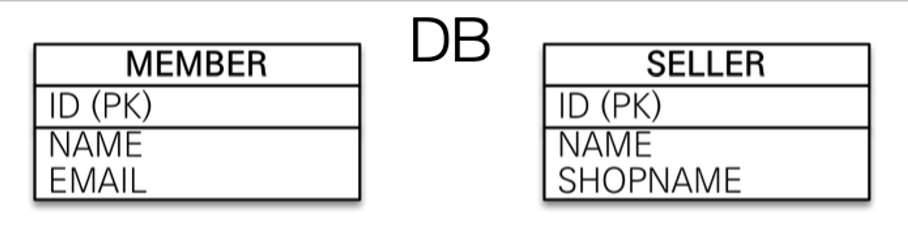

# Chapter 7 고급매핑

- 상속관계매핑 : 객체의 상속 관계를 데이터베이스에 어떻게 매핑하는지
- @MappedSuperclass : 등록일, 수정일 같이 여러 엔티티에서 공통으로 사용하는 매핑 정보만 상속받고 싶은 경우
- 복합 키와 식별 관계 매핑 : 데이터베이스의 식별자가 하나 이상일 때 매핑하는 방법
- 조인 테이블
- 엔티티 하나에 여러 테이블 매핑

### 1. 상속관계 매핑

---

객체지향에는 아래와 같이 클래스끼리 상속관계가 존재한다.


그러나 관계형 데이터베이스는 상속관계를 지원하지 않는다. 그 대신 데이터베이스의 슈퍼타입, 서브타입 관계라는 모델링 기법을 통해 객체의 상속관계를 매핑할 수 있다.


위의 그림은 Item을 슈퍼타입으로 Album, Movie, Book을 서브타입으로 모델링한것이다. 슈퍼타입과 서브타입이라는 논리 모델을 실제 물리 모델(테이블)로 구현하는 방법은 3가지다.

1. 각각 테이블로 변환 -> 조인 전략
2. 통합 테이블로 변환 -> 단일 테이블 전략
3. 서브타입 테이블로 변환 -> 구현 클래스마다 테이블 전략

세 가지 방법 모두 JPA를 통해 구현할 수 있다. 먼저 주요 애노테이션을 살펴보자.

- `@Inheritance(strategy = InheritanceType.XXX)`
    - JOINED: 조인 전략
    - SINGLE_TABLE: 단일 테이블 전략
    - TABLE_PER_CLASS: 구현 클래스마다 테이블 전략
- `@DiscriminatorColumn(name="DTYPE")`
- `@DiscrminatorValue("XXX")`

### 1.1 조인 전략


조인 전략은 슈퍼타입, 서브타입 논리모델을 각각 테이블로 옮긴 방식이다. 테이블이 구분되어 있기 때문에 데이터를 조회할 때 조인이 필요해서 조인 전략이라고 부른다.

```
@Entity
@Getter @Setter
@Inheritance(strategy = InheritanceType.JOINED)
@DiscriminatorColumn
public abstract class Item {

    @Id @GeneratedValue
    @Column(name = "ITEM_ID")
    private Long id;

    private String name;
    private int price;
}
```

슈퍼타입 Item 엔티티다. 슈퍼타입이 혹시라도 객체화 되지 않기 위해 추상 클래스로 선언했다.

슈퍼타입에서 `@Inheritance(strategy = InheritanceType.JOINED)` 을 통해 매핑전략을 조인 전략으로 지정했다.

`@DiscriminatorColumn` 애노테이션은 구분자 컬럼을 말한다. 조인 전략과 단일 테이블 전략에서 구분자 컬럼은 필수다. 구분자 컬럼을 통해 어떤 서브타입의 데이터인지 구분한다. 구분자 컬럼이 필요할 때 생략하면 자동으로 추가하지만 명시적으로 적어주는것을 추천한다. 구분자 컬럼의 이름은 기본값으로 "DTYPE" 이다. 사용자가 원하는 값으로 지정해줄 수 있지만 특별한 이유가 없다면 기본값을 그대로 쓰는것을 추천한다.

```
@Entity
@Getter @Setter
@DiscriminatorValue("A")
public class Album extends Item {

    private String artist;
}
```

서브타입 Album은 슈퍼타입 Item을 상속받는다. `@DiscriminatorValue`를 통해 구분자 컬럼의 값을 정할 수 있다. 기본값은 엔티티 이름이다.

조인 전략의 장단점을 살펴보자.

- 장점
    - 테이블이 정규화 된다.
    - 외래키 참조 무결성 제약조건을 활용할 수 있다.
    - 저장공간이 효율화된다.
- 단점
    - 조회시 조인이 필요하다. 조인이 필요하기 때문에 단일 테이블 전략에 비해 성능이 떨어질 수 있다.
    - 조인이 필요하기 때문에 단일 테이블 전략에 비해 조회 쿼리가 복잡하다.
    - 테이블이 나뉘어져 있기 때문에 저장시 INSERT SQL이 2번 호출된다. 단일 테이블 전략에 비해 성능이 떨어진다.

단점으로 성능이 떨어질 수 있다고 했지만 사실 요즘 컴퓨터는 성능이 좋기 때문에 데이터가 엄청 많지 않은 이상 성능이 엄청 떨어지지는 않는다. 바로 다음에 살펴볼 단일 테이블 전략은 조인이 필요 없지만 null 데이터가 많아지기 때문에 상황에 따라 오히려 조인 전략보다 성능이 떨어질 수 있다.

조인 전략은 상속관계를 매핑하는 전략중 데이터베이스 관점에서 가장 정규화된 깔끔하고 정석적인 전략이다.

### 1.2 단일 테이블 전략

조인 전략이 슈퍼타입과 서브타입을 정규화해서 각각 다른 테이블에 넣었다면 단일 테이블 전략은 이름 그대로 하나의 테이블에 모든 데이터를 몰아넣는 전략이다.


조인 전략과 마찬가지로 서브타입을 구별하기위해 구분자 컬럼이 필수다. 코드로 살펴보자.

```
@Entity
@Getter @Setter
@Inheritance(strategy = InheritanceType.SINGLE_TABLE)
@DiscriminatorColumn
public abstract class Item {

    @Id @GeneratedValue
    @Column(name = "ITEM_ID")
    private Long id;

    private String name;
    private int price;
}
```

```
@Entity
@Getter @Setter
@DiscriminatorValue("A")
public class Album extends Item {

    private String artist;
}
```

조인 전략에서 `@Inheritance(strategy = InheritanceType.SINGLE_TABLE)` 을 통해 전략을 바꿔준 것 말고는 바뀐 코드가 없다. 상속관계 매핑 전략만 바꿔줘도 JPA가 알아서 엔티티를 알맞은 테이블에 매핑해준다. 이것이 바로 ORM의 강력함이라고 볼 수 있다. ORM을 사용하지 않고 상속관계 매핑 전략을 바꿨다면 테이블 형태에 종속된 SQL을 엄청나게 수정해야될 것이다.

단일 테이블 전략의 장단점을 살펴보자.

- 장점
    - 조인이 필요 없기 때문에 일반적인 상황에서 조회 성능이 빠르다.
    - 조인이 필요 없기 때문에 조회 쿼리가 단순하다.
- 단점
    - 자식 엔티티에 매핑한 컬럼은 모두 null을 허용해야한다.
    - 테이블의 컬럼 길이가 커지기 때문에 상황에 따라 조회 성능이 오히려 느려질 수 있다.
    -

단일 테이블 전략은 한 테이블에 서브타입의 모든 데이터가 들어가기 때문에 테이블이 커진다. 그 대신 한 테이블만 사용하기 때문에 다루기는 편리하다.

조인 전략은 테이블을 정규화한 정석적이고 이상적인 전략이다. 단일 테이블 전략은 테이블을 다루기 편리한 실용적인 전략이다. 상황에 따라 둘 중 하나를 선택하면 된다. 단일 테이블 전략은 정규화도 포기해야하고 null값도 많이 들어가야하는 문제가 있지만 큰 문제가 없다고 예상되면 사용해도 괜찮다. 조인 전략은 정규화로 테이블이 많아지고 관리가 힘들어질 수 있기 때문에 상황에 따라 단일 테이블 전략보다 안 좋을 수 있다.

### 1.3 구현 클래스마다 테이블 전략

슈퍼타입은 테이블로 매핑하지 않고 서브타입만 테이블로 매핑하는 방법이다.


이전 코드에서 슈퍼타입에 `@Inheritance` 애노테이션의 전략 설정만 수정하면 된다.

- 장점
    - 서브타입만 명확하게 구분해서 처리할 수 있다.
    - 단일 테이블 전략에서는 불가능한 not null 제약조건을 사용할 수 있다.
- 단점
    - 여러 자식 테이블을 함께 조회할 때 성능이 매우 느리다. (UNION 연산 발생)
    - 자식 테이블을 통합해서 쿼리하기 어렵다.

결론을 말하자면, 이 전략은 실무에서 사용할 수 없다. 각 서브타입이 명확하게 각자의 테이블로 구분되긴 한다. 그러나 개념적으로 물품(Item)이라는 슈퍼타입에 종속되어 있는 각각의 서브타입 테이블들을 통합해서 관리하기가 매우 어려워진다. 예를 들어, 모든 물품의 가격의 평균을 구한다거나 하는 쿼리를 작성하기 매우 복잡하다. **상속관계 매핑은 조인 전략, 단일 테이블 전략 중 하나를 선택하도록 하자.**

### 2.  `@MappedSuperclass`

---

객체지향에서 상속을 단순히 속성을 재사용하기 위해 사용할 수 있다.


Member 클래스와 Seller 클래스는 공통 속성 id와 name을 가진다. 속성들을 각각의 클래스에 정의해도 되지만 공통 상위 클래스에 정의해서 속성을 물려받게 클래스를 설계할 수도 있다.

**상속관계 매핑과 헷갈리면 안 된다.** 상속관계 매핑처럼 상위 클래스 물품(Item) 타입에 하위 클래스 앨범(Album)을 종속시키는 것이 아니다. **단순히 공통 속성들만 재사용하기 위해 상속을 사용하는 것이다.** 상위 클래스는 엔티티가 아니고 자식 클래스에 속성만 물려준다. 엔티티가 아니기 때문에 당연히 상위 클래스로 조회, 검색 할 수 없다. **상위 클래스는 공통 속성의 모음일 뿐 객체화할 일이 없기 때문에 추상 클래스로 만들 것을 권장한다.**

Member, Seller 엔티티는 다음 그림의 테이블들과 매핑된다.



id, name이라는 같은 이름의 컬럼이 존재하지만 개념적으로 두 테이블은 서로 관련없는 독립적인 테이블이다.

```
@MappedSuperclass
@Getter @Setter
public abstract class BaseEntity {

    private String createdBy;
    private LocalDateTime createdAt;
    private LocalDateTime lastModifiedBy;
    private LocalDateTime lastModifiedAt;
}
```

실무에서는 주로 모든 엔티티에서 등록일, 수정일, 등록자, 수정자를 추적한다.

공통 속성들을 모은 BaseEntity 클래스를 만들었다. 실제 객체화 할 일이 없기 때문에 추상 클래스로 만들었다. 상위 클래스는 `@MappedSuperclass`를 통해 단순히 속성 정보만 모은 클래스임을 명시해줘야한다.

참고로 `@Entity` 애노테이션을 통해 엔티티가된 클래스는 또 다른 엔티티 클래스나 `@MappedSuperclass`로 지정한 클래스만 상속할 수 있다.

```java
@Entity
@Getter @Setter
@Inheritance(strategy = InheritanceType.JOINED)
@DiscriminatorColumn
public abstract class Item extends BaseEntity {

    @Id @GeneratedValue
    @Column(name = "ITEM_ID")
    private Long id;

    private String name;
    private int price;
}
```

상속관계 매핑 예제에서 사용한 Item 클래스가 BaseEntity 클래스를 상속받도록했다. Item을 상속받는 Album, Book, Movie 도 모두 공통 속성을 물려받게 된다.


### 3. 복합 키와 식별 관계 매핑

---

데이터베이스 테이블 사이에 관계는 외래 키가 기본 키에 포함되는지 여부에 따라 식별 관계와 비식별 관계로 구분한다.  **최근에는 비식별 관계를 주로 사용**하고 꼭 필요한 곳에만 식별 관계를 사용하는 추세이다.

JPA는 식별 관계, 비식별 관계 모두 지원한다.

### **7.3.1 식별 관계 vs 비식별 관계**

### **식별관계**

- 부모 테이블의 기본 키를 내려받아 자식 테이블의 기본 키 + 외래 키로 사용하는 관계


### ✅ **비식별 관계**

- 부모 테이블의 기본 키를 받아서 자식 테이블의 외래 키로만 사용하는 관계


- **필수적 비식별 관계(Mandatory)**: 외래 키에 NULL을 허용하지 않는다. 연관관계가 필수적
- **선택적 비식별 관계(Optional)**: 외래 키에 NULL을 허용한다. 연관관계가 선택적

## **7.3.2 복합 키: 비식별 관계 매핑**

- JPA에서 식별자를 둘 이상 사용하려면 별도의 식별자 클래스가 필요하다.
- 식별자를 구분하기 위해 equals와 hashCode를 구현하여 동등성 비교를 한다.

    ```java
    @Entity
    public class Hello {
    		@Id
    		private String id;
    		@Id
    		private String id2; //오류 발생
    }
    ```

- JPA는 복합 키를 지원하기 위해 @IdClass와 @EmbeddedId 2가지 방법을 제공한다.
  - @IdClass는 관계형 데이터베이스에 가까운 방법
  - @EmbeddedId는 객체지향에 가까운 방법

### **@IdClass**

- `PARENT` 테이블의 기본키가 `PARENT_ID1`, `PARENT_ID2`**의 복합키로 식별자 클래스가 필요하다.**


> 식별자 클래스
>

```java
public class ParentId implements Serializable {
		private String id1;//Parent.id1 매핑
		private String id2;//Parent.id2 매핑

		public ParentId() {
		}
		public ParentId(String id1, String id2) {
				this.id1 = id1;
				this.id2 = id2;
		}

		@Override
		public boolean equals(Object o) {...}
		@Override
		public int hashCode() {...}
}
```

> Parent
>

```java
@Entity
**@IdClass(ParentId.class)**
public class Parent {
		@Id
		**@Column(name = "PARENT_ID1")**
		private String id1; // ParentId.id1과 연결
		@Id
		**@Column(name = "PARENT_ID2")**
		private String id2; //ParentId.id2과 연결
		...
}
```

### **식별자 클래스의 만족 조건**

- **식별자 클래스의 속성명**과 **엔티티에 사용하는 식별자 속성명**이 **동일**해야 함
  - `Parent.id1` = `ParentId.id1`, `Parent.id2` = `ParentId.id2`
- `Serializable` 인터페이스를 구현
- `equals`, `hashCode`를 구현
- 기본 생성자가 필요
- **식별자 클래스**는 `public`으로 선언

> 실제 사용 코드
>

```java
//저장
Parent parent = new Parent();
parent.setId1("myId1");//식별자
parent.setId2("myId2");//식별자
parent.setName("parentName");
em.persist(parent);

//조회
ParentId parentId = new ParentId("myId1", "myId2");
Parent parent = em.find(Parent.class, parentId);
```

> Child
>

```java
@Entity
public class Child {
		@Id
		private String id;

		// 부모 테이블의 기본 키 컬럼이 복합 키이므로 자식 테이블의 외래 키도 복합 키다.
                // 따라서 외래 키 매핑 시 여러 컬럼을 매핑해야 하므로 @JoinColumns 어노테이션을 사용하고 각각의 외래 키 컬럼을 @JoinColumn으로 매핑한다.
                // 참고로 예제처럼 @JoinColumn의 name 속성과 referencedColumnName 속성의 값이 같으면 referencedColumnName은 생략해도 된다.
		@ManyToOne
		@JoinColumns({
				@JoinColumn(name = "PARENT_ID1", referencedColumnName = "PARENT_ID1"),
				@JoinColumn(name = "PARENT_ID2", referencedColumnName = "PARENT_ID2")
		})
		private Parent parent;
}
```

- 외래 키가 복합키이므로 `@JoinColumns`을 사용, 각각 외래키 컬럼을 `@JoinColumn`으로 매핑한다.
- `@JoinColumn`의 `name`과 `referencedColumnName`값이 같으면 `referencedColumnName` 생략 가능

### **`@EmbeddedId`**

- @IdClass가 데이터베이스에 맞춘 방법이라면 @EmbeddedId는 좀 더 객체지향적인 방법

> 식별자 클래스
>

```java
@Embeddable
public class ParentId implements Serializable {
		@Column(name = "PARENT_ID1")
		private String id1;
		@Column(name = "PARENT_ID2")
		private String id2;

//equals and hashCode 구현
		...
}
```

> Parent
>

```java
@Entity
public class Parent {
		@EmbeddedId
		private **ParentId** id;

		...
}
```

### **`@EmbeddedId`를 적용한 식별자 클래스의 만족 조건**

- `@Embeddable` 어노테이션을 사용
- `Serializable` 인터페이스 구현
- `equals`, `hashCode`를 구현
- 기본 생성자 필요
- 식별자 클래스 public으로 선언

> 실제 사용 코드
>

```java
//저장
Parent parent = new Parent();
ParentId parentId = new ParentId("myId1", "myId2");
parent.setId(parentId);
parent.setName("parentName");
em.persist(parent);

//조회
ParentId parentId = new ParentId("myId1", "myId2");
Parent parent = em.find(Parent.class, parentId);
```

### 

### **`@Idclass` vs `@EmbeddedId`**

- @EmbeddedId가 @Idclass와 비교해서 더 객체지향적이고 중복도 없어서 좋아보이긴 하지만 특정 상황에 JPQL이 조금 더 길어질 수 있다.

```
em.createQuery("select p.id.id1, p.id.id2 from Parent p"); //@EmbeddedId
em.createQuery("select p.id1, p.id2 from Parent p"); //@IdClass
```

## **7.3.3 복합 키: 식별 관계 매핑**

- 부모, 자식, 손자까지 기본 키를 전달하는 식별 관계 구조


### **@IdClass와 식별 관계**

- 식별 관계는 기본 키와 외래 키를 같이 매핑, `@Id`와 `@ManyToOne`을 같이 사용

    ```java
    @Id
    @ManyToOne
    @JoinColumn(name = "PARENT_ID")
    public Parent parent;
    ```


### **@EmbeddedId와 식별 관계**

- 식별 관계를 구성할 때 @MapsId를 사용
- `@IdClass`와 다른 점은 `@Id` 대신 `@MapsId`를 **사용**
- `@MapsId`는 **외래 키와 매핑한 연관관계를 기본 키에도 매핑**한다는 의미
- `@MapsId`의 **속성 값**은 `@EmbeddedId`를 사용한 **식별자 클래스의 기본 키 필드를 지정**

```java
// 자식
@Entity
public class Child {
@EmbeddedId
private ChildId id;

@MapsId("parentId") // ChildId.parentId 매핑
@ManyToONE
@JoinColumn(name = "PARENT_ID")
public Parent parent;

...
}

// 자식 ID
@Embeddable
public class ChildId implements Serializable {
private String parentId; // @MapsId("parentId")로 매핑

@Column(name = "CHILD_ID")
private String id;

// equals, hashCode
...
}

// 손자
@Entity
public class GrandChild {
@EmbeddedId
private GrandChildId id;

@MapsId("childId") // GrandChildId.childId 매핑
@ManyToOne
@JoinColumns({
	@JoinColumn(name = "PARENT_ID"),
    @JoinColumn(name = "CHILD_ID")
})
private Child child;
...
}

// 손자 Id
@Embeddable
public class GrandChildId implments Serializable {
private ChildId childId; // @MapsId("childId")로 매핑

@Column(name = "GRANDCHILD_ID")
private String id;

// equlas, hashCode
...
}
```

## **7.3.4 비식별 관계로 구현**

- 복합 키가 없으므로 복합 키 클래스 없이 구현 가능 (매핑, 코드가 단순)


> 비식별 관계 매핑
>

```java
//부모
@Entity
public class Parent {
		@Id @GeneratedValue
		@Column(name = "PARENT_ID")
		private Long id;
		...
}

//자식
@Entity
public class Child {
		@Id @GeneratedValue
		@Column(name = "CHILD_ID")
		private Long id;
		private String name;

		@ManyToOne
		@JoinColumn(name = "PARENT_ID")
		private Parent parent;
		...
}

//손자
@Entity
public class GrandChild {
		@Id @GeneratedValue
		@Column(name = "GRANDCHILD_ID")
		private Long id;
		private String name;

		@ManyToOne
		@JoinColumn(name = "CHILD_ID")
		private Child child;
		...
}
```

## **7.3.5 일대일 식별 관계**

- 자식 테이블의 기본 키 값으로 부모 테이블의 기본 키 값만 사용


> 일대일 식별 관계 매핑
>

```java
//부모
@Entity
public class Board {
		@Id @GeneratedValue
		@Column(name = "BOARD_ID")
		private Long id;
		private String title;

		@OneToOne(mappedBy = "board")
		private BoardDetail boardDetail;
		...
}

//자식
@Entity
public class BoardDetail {
		@Id
		private Long boardId;

		@MapsId//BoardDetail.boardId 매핑
		@OneToOne
		@JoinColumn(name = "BOARD_ID")
		private Board board;
		...
}
```

- BoardDetail처럼 식별자가 단순히 컬럼하나면 @MapsId의 속성없이 사용 가능
  - @MapsId는 @Id를 사용해서 식별자로 지정한 BoardDetail.boardId와 매핑

> 일대일 식별 관계 저장
>

```java
public void save() {
		Board board = new Board();
		board.setTitle("제목");
		em.persist(board);

		BoardDetail boardDetail = new BoardDetail();
		boardDetail.setContent("내용");
		boardDetail.setBoard(board);
		em.persist(boardDetail);
}
```

## **7.3.6 식별, 비식별 관계의 장단점**

### 식별 관계의 단점

- 식별 관계는 부모 테이블 기본 키를 자식 테이블로 전파하며 자식 테이블의 기본 키 컬럼들이 점점 증가
  - ex) 부모테이블 기본 키 컬럼 1개, 자식 테이블 기본 키 컬럼 2개, 손자 테이블 기본키 컬럼 3개
  - 조인할 때 SQL이 복잡해지고 기본키 인덱스가 불필요하게 커짐
- 2개 이상의 컬럼을 합해 복합 기본 키를 만들어야 하는 경우가 빈번
- 식별 관계는 비즈니스 의미가 있는 자연 키 컬럼을 조합 반면, 비식별 관계의 기본키는 비즈니스와 관계없는 대리 키를 사용 → 비즈니스 요구사항은 시간이 지나면 변경되므로 자연키가 전파되면 변경이 어려움
- 식별 관계는 2개 이상의 컬럼을 묶은 복합키를 주로 사용 → JPA에선 복합 키 클래스를 만들어야 하는 번거로움이 발생
- 비식별 관계는 대리 키를 주로 사용하므로 @GeneratedValue 등 키생성에 편리한 방법 제공

### **식별 관계의 장점**

- 기본 키 인덱스 활용이 좋음
- 상위 테이블들의 기본 키 컬럼을 가지고 있어 특정 상황에 조인 없이 검색 가능
  - 부모 아이디가 A인 모든 자식 조회

    ```SQL
    SELECT * 
    FROM  CHILD
    WHERE PARENT_ID = 'A'
    ```

  - 부모 아이디가 A고 자식 아이디가 B인 자식 조회

    ```SQL
    SELECT * 
    FROM   CHILD
    WHERE  PARENT_ID = 'A' 
    AND    CHILD_ID  = 'B'
    ```


### **정리**

- **비식별 관계를 사용**하고 기본 키는 **Long 타입의 대리 키를 사용**하는 것을 추천
- **대리 키**는 비즈니스와 관련이 없으므로 **유연한 대처가 가능하다는 장점**
- **식별자의 데이터 타입은 Long**을 추천 (Integer는 20억, Long은 920경)
- **선택적인 비선별 관계(외부 조인)** 보단 **필수적 관계(내부 조인)를 사용하는 것을 추천**

### 4. 조인 테이블

---

데이터베이스 테이블의 **연관관계**를 설계하는 방법

- @JoinColumn : 조인 컬럼 사용(외래 키)
- @JoinTable : 조인 테이블 사용(테이블 사용)

### **조인 컬럼 사용**


- `LOCKER`를 선택적으로 입력 받는 상황에선 선택적 비식별 관계를 사용 (외래 키 null 허용)
- 선택적 비식별 관계는 조인할 때 외부 조인(`OUTER JOIN`)을 사용 실수로 내부 조인을 사용하면 사물함이 없는 회원은 조회되지 않음
- 아주 가끔 관계를 맺는다면 외래 키 값 대부분이 null로 저장되는 단점

### **조인 테이블 사용**


- 연관관계를 관리하는 조인 테이블(`MEMBER_LOCKER`)을 추가하고 외래 키를 가지고 관리
- 단점은 테이블을 하나 추가해야 한다는 점, 관리 테이블과 조인 횟수가 증가
- **조인 테이블은 주로 다대다 관계를 일대다, 다대일 관계로 풀기위해 사용** 그렇지만 일대일, 일대다, 다대일 관계에서도 사용가능

## **7.4.1 일대일 조인 테이블**


> 일대일 조인 테이블 매핑
>

```java
//부모
@Entity
public class Parent {
		@Id @GeneratedValue
		@Column(name = "PARENT_ID")
		private Long id;
		private String name;

		@OneToOne
		@JoinTable(name = "PARENT_CHILD",
				joinColumns = @JoinColumn(name = "PARENT_ID"),
				inverseJoinColumns = @JoinColumn(name = "CHILD_ID"))
		private Child child;
		...
}

//자식
@Entity
public claass Child {
		@Id @GeneratedValue
		@Column(name = "CHILD_ID")
//@OneToOne(mappedBy="child") 양방향으로 매핑하는 경우 사용
		private Long id;
		private String name;
		...
}
```

### **@JoinTable 속성**

- `name`: 매핑할 조인 테이블 이름
- `joinColumns`: 현재 엔티티를 참조하는 외래 키
- `inverJoinColumns`: 반대방향 엔티티를 참조하는 외래 키

## **7.4.2 일대다 조인 테이블**

- 다(N)와 관련된 컬럼인 `CHILD_ID`에 유니크 제약 조건이 필요


> 일대다 단방향 조인 테이블 매핑
>

```java
//부모
@Entity
public class Parent {
		@Id @GeneratedValue
		@Column(name = "PARENT_ID")
		private Long id;
		private String name;

		@OneToMany
		@JoinTable(name = "PARENT_CHILD",
				joinColumns = @JoinColumn(name = "PARENT_ID"),
				inverseJoinColumns = @JoinColumn(name = "CHILD_ID"))
		private List<Child> child = new ArrayList<Child>();
		...
}

//자식
@Entity
public class Child {
		@Id @GeneratedValue
		@Column(name = "CHILD_ID")
		private Long id;
		private String name;
}

```

## **7.4.3 다대일 조인 테이블**

```java
//부모
@Entity
public class Parent {
		@Id @GeneratedValue
		@Column(name = "PARENT_ID")
		private Long id;
	  private String name;

	  @OneToMany(mappedBy = "parent")
	  private List<Child> child = new ArrayList<Child>();
		...
}

//자식
@Entity
public class Child {
	  @Id @GeneratedValue
	  @Column(name = "CHILD_ID")
	  private Long id;
	  private String name;

	  @ManyToOne(optional = false)
	  @JoinTable(name = "PARENT_CHILD",
	    joinColumns = @JoinColumn(name = "CHILD_ID"),
	    inverseJoinColumns = @JoinColumn(name = "PARENT_ID"))
	  private Parent parent;
		...
}
```

## **7.4.4 다대다 조인 테이블**

- 조인 테이블의 두 컬럼을 합해 하나의 복합 유니크 제약조건 설정


> 다대다 조인 테이블 매핑
>

```java
//부모
@Entity
public class Parent {
		@Id @GeneratedValue
		@Column(name = "PARENT_ID")
		private Long id;
		private String name;

		@ManyToMany
		@JoinTable(name = "PARENT_CHILD",
				joinColumns = @JoinColumn(name = "PARENT_ID"),
				inverseJoinColumns = @JoinColumn(name = "CHILD_ID"))
		private List<Child> child = new ArrayList<Child>();
		...
}

//자식
@Entity
public class Child {
		@Id @GeneratedValue
		@Column(name = "CHILD_ID")
		private Long id;
		private String name;
		...
}
```

### 5. **엔티티 하나에 여러 테이블 매핑**

---

- @SecondaryTable을 사용하면 한 엔티티에 여러 테이블을 매핑
- @SecondaryTable을 사용해서 두 테이블을 하나의 엔티티에 매핑하는 방법보다는 **테이블당 엔티티를 각각 만들어서 일대일 매핑하는 것을 권장**
- 이 방법은 항상 두 테이블을 조회하므로 최적화하기 어렵다.
- 반면에 일대일 매핑은 원하는 부분만 조회할 수 있고 필요하면 둘을 함께 조회하면 된다.
- 잘 사용하지는 않는다.

```java
@Entity
@Table(name = "BOARD")
@SecondaryTable(name = "BOARD_DETAIL", // 매핑할 다른 테이블의 이름
	pkJoinColumns = @PrimaryKeyJoinColumn(name = "BOARD_DETAIL_ID")) // 매핑할 다른 테이블의 기본 키 컬럼 속성
public class Board {

	 @Id @GeneratedValue
    @Column(name = "BOARD_ID")
    private Long id;

    private String title;

    @Column(table = "BOARD_DETAIL") // BOARD_DETAIL 테이블의 컬럼에 매핑
    private String content;
    ...
}
```
