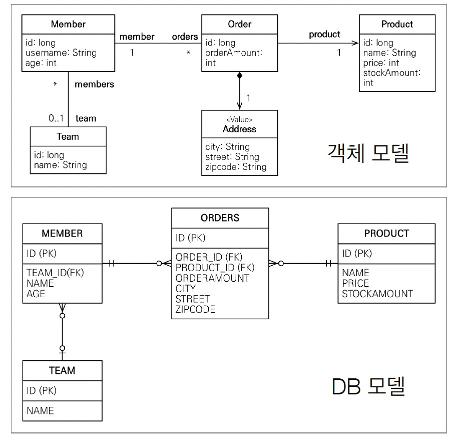
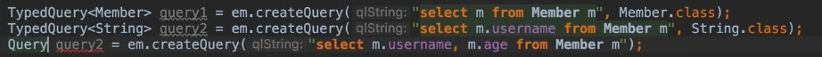

Chapter 10 "객체지향 쿼리 언어"
--

10장에서 배울 내용

- ✔️ **객체지향 쿼리 소개**
- ✔️ **JPQL**
- Criteria
- QueryDSL
- 네이티브 SQL - JPQL을 쓰더라도 특정 벤더에 종속적인 쿼리를 사용해야하는 경우 사용
- 객체지향 쿼리 심화

JPA는 다양한 쿼리방법을 지원한다.
JPQL로 웬만해선 다 해결되기는 한다.

## **객체지향 쿼리 소개**

### 1. JPQL(Java Persistence Query Language)

- JPA를 사용하면 엔티티 객체를 중심으로 개발이 가능하다
- 문제는 검색 쿼리
    - 검색을 할 때에도 테이블이 아닌 엔티티 객체를 대상으로 검색
    - 모든 DB 데이터를 객체로 변환해서 검색하는 것은 불가능
    - 애플리케이션이 필요한 데이터만 DB에서 불러오려면 결국 검색 조건이 포함된 SQL이 필요하다
- JPA는 SQL을 추상화한 JPQL이라는 객체 지향 쿼리 언어 제공
- SQL과 문법 유사
    - SELECT, FROM, WHERE, GROUP BY, HAVING, JOIN 지원
- JPQL은 엔티티 객체를 대상으로한 쿼리
- SQL은 데이터베이스 테이블을 대상으로한 쿼리

```java
// 검색
// 아래에서 m 은 Member 자체를 가져온다는 것을 의미
String jpql = "select m From Mermber m where m.name like '%hello%'";
List<Member> result = em.createQuery(jpql, Member.class)
				.getResultList();
```

```sql
-- 실행된 SQL
select
	m.id as id,
	m.age as age,
        m.username as USERNAME,
        m.team_id as TEAM_ID
from 
	Member m
where 
	m.name '%hello%'
```

- 테이블이 아닌 객체를 대상으로 검색하는 객체 지향 쿼리
- SQL을 추상화해서 특정 데이터베이스 SQL에 의존 X
- JPQL을 한마디로 정의하면 객체 지향 SQL

### 2. Criteria 소개

- JPQL은 String 이기 때문에  동적쿼리를 작성해야 할 때 어려움
- Criteria는 문자가 아닌 자바코드로 JPQL을 작성할 수 있음

```java
//Criteria 사용 준비
CriteriaBuilder cb = em.getCriteriaBuilder();
CriteriaQuery<Member> query = cb.createQuery(Member.class);

//루트 클래스 (조회를 시작할 클래스)
Root<Member> m = query.from(Member.class);
//쿼리 생성 
CriteriaQuery<Member> cq = query.select(m).where(cb.equal(m.get("username"), “kim”));
List<Member> resultList = em.createQuery(cq).getResultList();
```

- JPQL 빌더 역할
- JPA 공식 기능
- 복잡하고 유지보수가 어려우며 실무에서 잘 안씀
- Criteria 대신 QueryDSL 사용 권장

### 3. QueryDSL 소개

- 문자가 아닌 자바코드로 JPQL을 작성할 수 있음

```java
JPAFactoryQuery query = new JPAQueryFactory(em);
QMember m = QMember.member;
List<Member> list = 
		query.selectFrom(m)
		     .where(m.age.gt(18))
                     .orderBy(m.name.desc())
	             .fetch();
```

- JPQL 빌더 역할
- 컴파일 시점에 문법 오류를 찾을 수 잉ㅆ음
- 동적쿼리 작성이 편리함
- 오픈소스임 [http://querydsl.com/static/querydsl/5.0.0/reference/html_single/](http://querydsl.com/static/querydsl/5.0.0/reference/html_single/)
- 단순하고 쉬움. 실무 사용 권장

### 4. 네이티브SQL 소개

- JPA가 제공하는 SQL을 직접 사용하는 기능

```java
String sql =“SELECT ID, AGE, TEAM_ID, NAME FROM MEMBER WHERE NAME = ‘kim’";
List<Member> resultList = 
			em.createNativeQuery(sql, Member.class).getResultList();
```

- JPQL로 해결할 수 없는 특정 데이터베이스에 의존적인 기능
    - ex) 오라클 CONNECT BY, 특정 DB만 사용하는 SQL 힌트


### 5. JDBC 직접 사용, SpringJdbcTemplate 등

- JPA를 사용하면서 JDBC 커넥션을 직접 사용하거나, 스프링 JdbcTemplate, Mybatis 등을 함께 사용 가능
    - 단, 영속성 컨텍스트를 적절한 시점에 강제로 flush 필요
    - ex) JPA를 우회해서 SQL을 실행하기 직전에 영속성 컨텍스트 수동 flush

```java
Member member = new Member();
mermber.setUsername("mermber1");
em.persist(member);

em.flush(); // 아래에서 출력되기 위해선 강제로 flush

// JDBC 커텍션 직접 사용 예제
dbconnect.executeQuery("select * from member");
```
## JPQL(Java Persistence Query Language)
### 1. 기본 문법과 쿼리 API

- 객체지향 쿼리 언어다. 따라서 테이블을 대상으로 쿼리 하는 것이 아니라 **엔티티 객체를 대상으로 쿼리**한다.
- SQL을 추상화해서 특정데이터베이스 SQL에 의존하지 않는다.
- 결국 SQL로 변환된다.



### 2. 문법

- select_문 :: =
  
               select_절
               from_절
               [where_절]
               [groupby_절]
               [having_절]
               [orderby_절]
- update_문 :: =

                update_절 
                [where_절]

- delete_문 :: =

                delete_절 
                [where_절]


- select m from **Member** as m where **m.age** > 18
- 엔티티와 속성은 대소문자 구분O
- JPQL 키워드는 대소문자 구분X (SELECT, FROM, where)
- 엔티티 이름 사용, 테이블 이름이 아님(Member)
- **별칭은 필수(m)** (as는 생략가능)
- TypeQuery
  - 반환 타입이 명확할 때 사용

    ```java
    TypedQuery<Member> query = em.createQuery("SELECT m FROM Member m", Member.class);
    ```

- Query
  - 반환 타입이 명확하지 않을 때 사용

    ```java
    Query query = em.createQuery("SELECT m.username, m.age from Member m");
    ```



- 결과 조회 API
  - query.getResultList()
    - **결과가 하나 이상일 때**, 리스트 반환
    - 결과가 없으면 빈 리스트 반환 (NPE 발생 X)
  - query.getSingleResult()
    - **결과가 정확히 하나**, 단일 객체 반환
    - 결과가 없으면 ⇒ javax.persistence.NoResultException
    - 둘 이상이면 ⇒ javax.persistence.NonUniqueResultException
    - try catch 문 사용해서 에러 방지해야 함
- 파라미터 바인딩
    - 이름기준
    
    ```java
    SELECT m FROM Member m where m.username = :username
    query.setParameter("username", usernameParam);
    ```
    
    - 위치기준 (유지보수 어렵고 장애 발생 시 파악하기 어렵기 때문에 사용하지 말자)
    
    ```java
    SELECT m FROM Member m where m.username = ?1
    query.setParameter(1, usernameParam);
    ```
    
  - 프로젝션
      - SELECT 절에 조회할 대상을 지정하는 것
      - 프로젝션 대상: 엔티티, 임베디드 타입, 스칼라 타입(숫자, 문자등 기본 데이터 타입)
      - 엔티티 프로젝션
          - 조회한 엔티티는 **영속성 컨텍스트** 에서 관리된다.
          - SELECT **m** FROM Member m
    
      ```java
      Member member = new Member();
      member.setUsername("member1");
      member.setAge(10);
      em.persist(member);
    
      List<Member> result = em.createQuery("select m from Member m", Member.class)
              .getResultList();
      ```
    
      일반적인 조회 방법은 여태 써왔던 방식 그대로 사용하면 된다. 
    
      ⭐️ 이렇게 여러건을 조회해와도 영속성 컨텍스트에 모두 올라갈까?
    
      ```java
      em.flush();
      em.clear();
    
      List<Member> result = em.createQuery("select m from Member m", Member.class)
              .getResultList();
    
      Member findMember = result.get(0);
      findMember.setAge(20);
      ```
    
      처음 예제에서 추가로 코드를 넣어줬다. 먼저 영속성 컨텍스트를 모두 비우고 Member를 조회한다. 
    
      그리고 나서 Member를 하나 가져오고 그 Member의 Age를 바꿔준다. 
    
      만약 UPDATE 쿼리가 실행되면 영속성 컨텍스트에서 관리가 되고 있는 것이고, 실행되지 않는다면 영속성 컨텍스트에 없다는 말이다.
    
      ```java
      Hibernate: 
          /* update
              jpql.Member */ update
                  Member 
              set
                  age=?,
                  TEAM_ID=?,
                  username=? 
              where
                  id=?
      ```
    
      출력 로그를 확인해보면 UPDATE 쿼리가 잘 실행되는 것을 볼 수 있다. JPA에서 1개든 10개든 100개든 조**회해오는 모든 데이터는 영속성 컨텍스트로 올라간다.**
    
      - SELECT **m.team** FROM Member m
    
      ```java
      List<Team> result = em.createQuery("select m.team from Member m", Team.class)
              .getResultList();
      ```
    
      코드를 위와 같이 수정한다. 조회를 해 오는 데이터가 m.team이므로 Team.class로 변경해야한다. 그리고 실행을 해보면 JOIN 쿼리가 실행됨
    
      ```java
      Hibernate: 
          /* select
              m.team 
          from
              Member m */ select
                  team1_.id as id1_3_,
                  team1_.name as name2_3_ 
              from
                  Member member0_ 
              inner join
                  Team team1_ 
                      on member0_.TEAM_ID=team1_.id
      ```
    
      심플하게 JPQL로 작성했는데 쿼리는 복잡하게 실행됨. 좋은 기능 같지만  JOIN의 경우엔 성능과 직접적으로 연관되어 있는 기능이기도 하고 튜닝도 할 수 있기 때문에 한 눈에 보여야하는게 좋음. 
    
      따라서 코드를 아래와 같이 **Join 을 사용하여 직관적으로 사용하는 것을 추천**
    
      ```java
      List<Team> result = em.createQuery("select m.team from Member m join m.team t", Team.class)
              .getResultList();
      ```
    
      - 임베디드 타입 프로젝션
          - **임베디드 타입은 엔티티 타입이 아닌 값 타입이다. 영속성 컨텍스트 관리되지 않는다.**
          - SELECT **m.address** FROM Member m
        
          ```java
          List<Address> result = em.createQuery("select o.address from Order o", Address.class)
                  .getResultList();
          ```
        
          아래 처럼 사용 불가능(Address는 어떤 다른 객체에 소속되어 있기 때문에 단독으로 사용이 불가능)
        
          ```java
          List<Address> result = em.createQuery("select a from Address a", Address.class)
          .getResultList();
          ```
      - 스칼라 타입 프로젝션
           - 기본 데이터 타입
        ```java
        SELECT **m.username, m.age** FROM Member m
        ```        
      - DISTINCT로 중복 제거
      
        ```java
        SELECT DISTINCT username FROM Member m
        ```
    
    - 여러 값 조회
    
      ```java
      em.createQuery("select distinct m.username, m.age from Member m")
              .getResultList();
      ```
    
      스칼라 타입에는 username과 age 두 개의 필드가 존재한다. 이 데이터를 어떻게 가져와야 할까?
    
    1) Query 타입 사용(반환 타입이 명확하지 않을 때)
    
      ```java
      Query query = em.createQuery("select distinct m.username, m.age from Member m")
              .getResultList();
      List resultList = query.getResultList();
      ```
    
      Query 타입의 반환 값은 List이다. List에는 특정 타입을 넣을 수 없으니 Object로 돌려준다. 
    
      따라서 값을 가져올 때는 아래와 같이 형변환을 통해 값을 가져와야 한다.
    
      ```java
      Object o = resultList.get(0);
      Object[] result = (Object[]) o;
      System.out.println("result = " + result[0]);
      System.out.println("result = " + result[1]);
      ```
    
      ```java
      // 출력 로그
      Hibernate:
          /* select
              distinct m.username,
              m.age
          from
              Member m */ select
                  distinct member0_.username as col_0_0_,
                  member0_.age as col_1_0_
              from
                  Member member0_
      result = member1
      result = 10
      ```
    
      2) Object[] 타입 사용
          - List 제네릭에 Object[]를 넣어주면 형변환 작업 생략 가능
    
      ```java
      List<Object[]> resultList = em.createQuery("select distinct m.username, m.age from Member m")
              .getResultList();
    
      Object[] result = resultList.get(0);
      System.out.println("result = " + result[0]);
      System.out.println("result = " + result[1]);
      ```
    
      3) new 명령어 사용
          - 제일 깔끔한 방법
          - 단순 값을 DTO로 바로 조회
          - 패키지명을 포함한 전체 클래스 명 입력
          - 순서와 타입이 일치하는 생성자 필요

      MemberDTO 클래스 생성
    
    ```java
    public class MemberDTO {
    
        private String username;
        private int age;
    
        public MemberDTO(String username, int age) {
            this.username = username;
            this.age = age;
        }
        // getter/setter 생략
    }
    ```
    
    실행 클래스 코드
    
    ```java
    TypedQuery<MemberDTO> query = em.createQuery("select new jpql.MemberDTO(m.username, m.age) from Member m", MemberDTO.class);
    
    List<MemberDTO> resultList = query.getResultList();
    
    MemberDTO memberDTO = resultList.get(0);
    System.out.println("memberDTO = " + memberDTO.getUsername());
    System.out.println("memberDTO = " + memberDTO.getAge());
    ```
    
    원하는대로 작동이 되지만 쿼리에 구구절절 패키지명을 적어야 하는게 맞나 싶기도 하다. 
    
    추후 QueryDSL을 사용하면 이런 불편한 부분을 극복 가능!
    
- 페이징 API
    - **setFirstResult(int startPosition)** : 조회 시작 위치(0부터 시작)
    - **setMaxResults(int maxResult)** : 조회할 데이터 수

  ```java
  TypeQuery<Member> query = 
      em.createQuery("SELECT m FROM Member m ORDER BY m.username DESC",
      Member.class);
  
  // 11번째부터 20건의 데이터 조회, 11~30    
  query.setFirstResult(10);
  query.setMaxResult(20);
  query.getResultList();
  ```

- 집합과 정렬
    - COUNT, SUM, MIN, ORDER BY, GROUP BY… pass
- 조인
    - SQL 조인과 기능은 같고 문법만 약간 다르다.
    - 내부 조인
        - **INNER JOIN 사용, INNER** 는 생략 가능
    
    ```java
    SELECT m FROM Member m [INNER] JOIN m.team t
    ```
    
    - 외부 조인
        - **OUTER 생략가능**. 보통 **LEFT JOIN** 으로 사용
    
    ```java
    SELECT m FROM Member m LEFT [OUTER] JOIN m.team t
    ```
    
    - 세타 조인
        - 연관관계가 없지만 조회해보고 싶을 때
        - 내부 조인만 지원
    
    ```java
    select count(m) from Member m, Team t where m.username = t.name
    
    SELECT COUNT(M.ID)
    FROM MEMBER M CROSS JOIN TEAM T
    WHERE M.USERNAME = T.NAME
    ```
    
    - ON 절(JPA 2.1부터 지원)
    
- **경로 표현식**
    - 점(.)을 찍어 객체 그래프를 탐색하는 것
    - **m.username, m.team, m.orders, t.name 모두 경로 표현식**

```java
select m.username
from Member m
    join m.team t
    join m.orders o
where t.name = '팀A'
```

   - 많이 하는 실수 : 컬렉션 값에서 경로 탐색 시도

```java
select t.members from Team t            //성공
select t.members.username from Team t   //실패
```

- 컬렉션에서 경로 탐색하려면

```java
// join t.members m으로 컬렉션에 새로운 별칭을 얻음.
select m.username from Team t join t.members m
```

- SIZE라는 특별한 기능 제공

```java
select t.members.size from Team t
```

- 서브쿼리
    - SQL처럼 서브 쿼리 지원
    
- 조건식
    - 타입표현
  
        | 종류 | 예제 |
        | --- | --- |
        | 문자 | 'HELLO', 'Hi' |
        | 숫자 | 10L, 10D, 10F |
        | 날짜 | {d'2012-03-24'} |
        | 타임 | {t'10-11-11'} |
        | DATETIME | [ts'2014-03-24 10-11-11.123'} |
        | Enum | jpabook.MemberType.Admin |
        | 엔티티 타입 | TYPE(m) = Member |

    - Between, IN, Like, Null
    - 날짜함수
        - CURRENT_DATE : 현재 날짜
        - CURRENT_TIME : 현재 시간
        - CURRENT_TIMESTAMP : 현재 날짜 시간
    - CASE
        - 기본 CASE
        - COALESCE
            - null이 아니면 반환
        
        ```java
        // m.username이 null이면 '이름없는 회원' 반환
        select coalesce(m.username, '이름없는 회원') from Member m
        ```
        
- Named 쿼리
    - 어플리케이션 로딩 시점에 JPQL 문법을 체크하고 미리 파싱해줌
    - 오류를 빨리 확인할 수 있고, 사용하는 시점에는 파싱된 결과를 재사용
    - 성능상 👍
    - **@NamedQuery 어노테이션이나 XML에 작성 가능**    - 
    
    ```java
    @Entity
    @NamedQuery(
        name = "Member.findByUsername",
        query = "select m from Member m where m.username = :username")
    public class Member {
        ... 
    }
    
    // 사용
    List<Member> resultList = em.createNamedQuery("Member.findByUsername"),
                Member.class)
                .setParameter("username", "회원1")
                .getResultList();
    
    ```
    
    - 2개 이상 정의
    
      - @NamedQueries 어노테이션 사용
    
    ```java
    @Entity
    @NamedQueries({
        @NamedQuery(
            name = "Member.findByUsername",
            query = "select m from Member m where m.username = :username"),
        @NamedQuery(
            name = "Member.count"
            query = "select count(m) from Member m")
    })
    public class Member { ... }
    ```