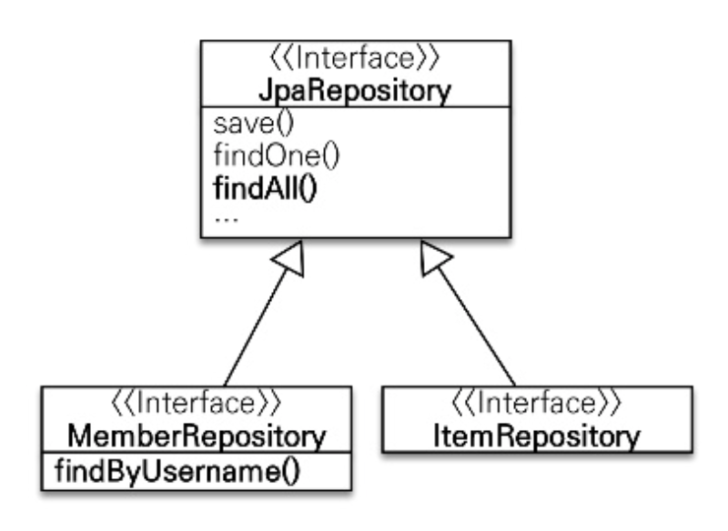
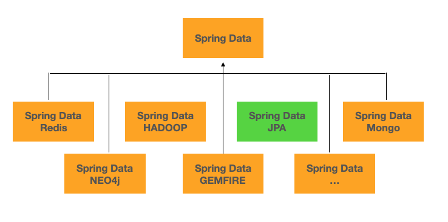
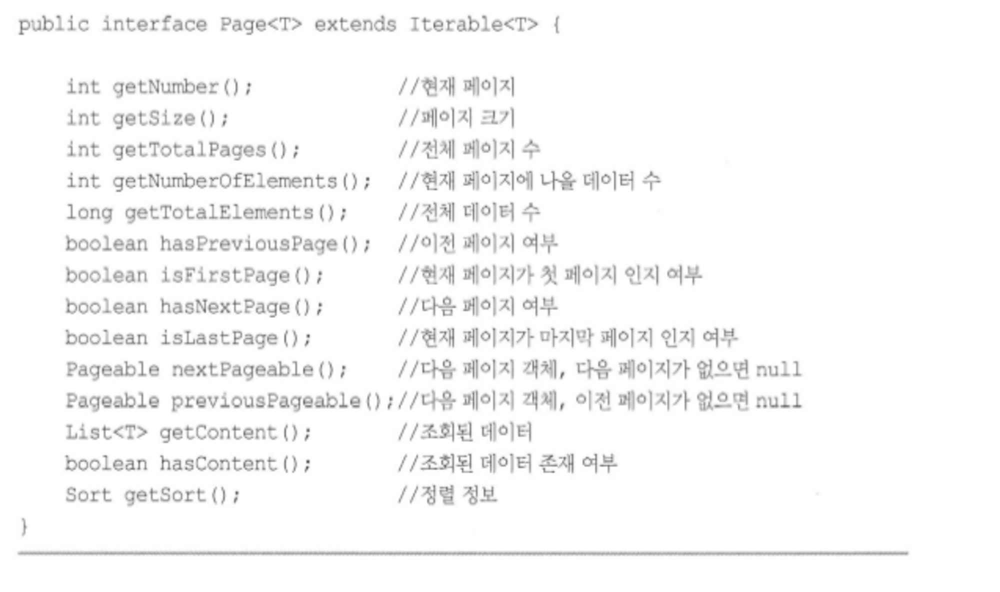

# Chapter 12 스프링 데이터 JPA

---

## 시작에 앞서

- 대부분의 데이터 접근 계층(Data Access Layer)은 일명 CRUD로 부르는 유사한 등록, 수정,삭제 조회 코드를 반복해서 개발해야한다.
- JPA를 사용해서 데이터 접근 계층을 개발할 때에도 이 같은 문제가 발생한다.

```java
public class MemberRepository {

    @PersistenceContext
    public EntityManager em;
    public void save(Member member) {...}
    public Member findOne(Long id) {...}
    public List<Member> findAll() {...}
    public Member findByUsername(String username) {...}
}

public class ItemRepository {

    @PersistenceContext
    public EntityManager em;
    public void save(Item item) {...}
    public Item findOne(Long id) {...}
    public List<Item> findAll() {...}

}
```

- 위 예제를 보면 MemberRepository와 ItemRepository가 하는 일이 비슷하다.
- JPA를 사용해도 대부분의 데이터 접근 계층은 CRUD라고 하는 코드를 반복해서 개발해야 하는 문제점이 존재한다. 이러한 단점을 해결하기 위해 나온 것이 `Spring Data JPA`이다.

## 12.1 스프링 데이터 JPA 소개

- `Spring Data JPA` 는 스프링 프레임워크에서 JPA를 편리하게 사용할 수 있도록 지원하는 프로젝트다.
- 위와 같은 단순하고 반복적인 CRUD 문제를 해결한다.
- 레포지토리를 개발할 때 인터페이스만 작성하면 실행 시점에 `Spring Data JPA`가 구현 객체를 동적으로 생성해서 주입해준다. 따라서 개발자가 직접 구현체를 개발하지 않아도 된다.

```java
public interface MemberRepository extends JpaRepository<Member, Long> {
    Member findByUsername(String username);
}

public interface ItemRpository extends JpaRepository<Item, Long> {
}
```

- 클래스 다이어 그램



- 일반적인 CRUD 메소드는 JpaRepository 인터페이스가 공통으로 제공하므로 문제가 없다.
- 하지만 MemberRepository.findByUsername(…) 처럼 직접 작성한 메소드는 어떻게 해야할까?
- 놀랍게도 `Spring Data JPA`는 메소드 이름을 분석해서 다음 JPQL을 실행한다.
    - select m from Member m where username =:username

### 12.1.1 스프링 데이터 프로젝트

- `Spring Data JPA`는 스프링 데이터 프로젝트의 하위 프로젝트 중 하나이다.



- `Spring Data 프로젝트`는 JPA, MongoDB, NEO4J, Redis, HADDOP, GEMFIRE 같은 다양한 데이터 저장소에 대한 접근을 추상화하여 반복적인 데이터 접근 코드를 줄여준다.
- 여기서 `Spring Data JPA 프로젝트`는 JPA에 특화된 기능을 제공한다.

## 12.2 스프링 데이터 JPA 설정

- 필요 라이브러리

```java
// gradle
implementation 'org.springframework.boot:spring-boot-starter-data-jpa'

// maven
<dependency>
    <groupId>org.springframework.data</groupId>
    <artifactId>spring-data-jpa</artifactId>
    <version>1.8.0.RELEASE</version>
</dependency>
```

- 환경설정
    1. 스프링 설정에 XML을 사용하는 경우
        1.  <jpa:respositories>를 사용하고 repository를 검색할 base-package를 적으면 해당 패키지와 그 하위 패키지를 검색

        ```java
        // XML 설정
        <?xml version="1.0" encoding="UTF-8"?>
        <beans xmlns="http://www.springframework.org/schema/beans"
               xmlns:xsi="http://www.w3.org/2001/XMLSchema-instance"
               xmlns:jpa="http://www.springframework.org/schema/data/jpa"
               xsi:schemaLocation="http://www.springframework.org/schema/beans 
                  http://www.springframework.org/schema/beans/spring-beans.xsd 
                  http://www.springframework.org/schema/data/jpa 
                  http://www.springframework.org/schema/data/jpa/spring-jpa.xsd">
        
        	<jpa:repositories base-package="jpabook.jpashop.repository" />
            
        </beans>
        ```

    2. 스프링 설정에 JavaConfig를 사용하는 경우
        1. EnableJpaRepositories 어노테이션을 추가하고 basePackage에는 리포지토리를 검색할 패키지 위치를 적는다.

        ```java
        // JavaConfig 설정
        @Configuratrion
        @EnableJpaRepositories(basePackage = "jpabook.jpashop.repository")
        public class AppConfig {}
        ```

    3. 동작 과정
        1. `Spring Data JPA`는 애플리케이션을 실행할 때 basePackage에 있는 repository interface들을 찾아서 해당 인터페이스를 구현한 클래스를 동적으로 생성한 후, 스프링 빈으로 등록한다. 따라서 개발자가 직접 구현 클래스를 만들지 않아도 된다.

## 12.3 공통 인터페이스 기능

- `Spring Data JPA`는 간단한 CRUD 기능을 공통으로 처리하는 JpaRepository 인터페이스를 제공한다.
- `Spring Data JPA`를 사용하는 가장 단순한 방법은 이 인터페이스를 상속받는 것이며, 그 후 제네릭에 엔티티 클래스와 엔티티 클래스가 사용하는 식별자 타입을 지정하면 된다.

```java
public interface JpaRepository<T, ID extends Serializable> extends PagingAndSortingRepository<T, ID> {
    ...
}
```

```java
public interface MemberRepository extends JpaRepository<Member, Long> {
}
```

- JpaRepository 인터페이스를 상속받으면 사용할 수 있는 주요 메소드

(여기에서 T는 엔티티, ID는 엔티티의 식별자 타입, S는 엔티티와 그 자식 타입을 뜻함)

- **save(S) :** 엔티티에 식별자가 없으면 EntityManager.persist()를 호출하여 새로운 엔티티는 저장하고식별자 값이 있으면 이미 있는 엔티티로 판단해서 EntityManager.merge()를 호출하여 수정
- **delete(T) :** 엔티티 하나를 삭제하며, 내부에서 EntityManager.remove()를 호출
- ㅎ**findOne(ID) :** 엔티티 하나를 조회하며, 내부에서 EntityManager.find()를 호출
- **getOne(ID):** 엔티티를 프록시로 조회하며, 내부에서 EntityManager.getReference()를 호출
- **findAll(...) :** 모든 엔티티를 조회하며, 정렬이나 페이징 조건을 파라미터로 제공할 수 있음

## 12.4 쿼리 메소드 기능

- `Spring Data JPA`의 마법같은 기능
- ex. **메소드 이름 만으로 쿼리를 생성**하는 기능
- 인터페이스 메소드만 선언하면 메소드 이름으로 JPQL 쿼리를 생성해서 실행
- ****`Spring Data JPA`**가 제공하는 쿼리 메소드 기능 3가지**
    - 메소드 이름으로 쿼리 생성
    - 메소드 이름으로 JPA NamedQuery 호출
    - @Query 어노테이션을 사용해서 Repository 인터페이스에 쿼리 직접 정의

### 12.4.1 메소드 이름으로 쿼리 생성

- 예시코드

```java
public interface MemberRepository extends Repository<Member, Long> {
    List<Member> findByEmailAndName(String email, String name);
}
```

- 인터페이스에 정의한 findByEmailAndName(…) 메소드를 실행하면, `Spring Data JPA`는 메소드 이름을 분석해서 JPQL을 생성하고 실행한다.

```sql
select m from Member m where m.email = ?1 and m.name = ?2
```

‼️ 정해진 규칙에 따라 메소드 이름을 지어야 한다.

- 관련 메소드 링크

[https://docs.spring.io/spring-data/jpa/docs/1.3.0.RELEASE/reference/html/jpa.repositories.html](https://docs.spring.io/spring-data/jpa/docs/1.3.0.RELEASE/reference/html/jpa.repositories.html)

### 12.4.2 JPA NamedQuery

- `Spring Data JPA`는 메소드 이름으로 JPA Named 쿼리를 호출하는 기능 제공
- 이름 그대로 쿼리에 이름을 부여해서 사용하는 방법
- 어노테이션이나 XML에 쿼리를 정의하여 사용

```java
@Entity
@NamedQuery(name="Member.findByUsername",
 query="select m from Member m where m.username= :username")
public class Member {
	...
}
```

```xml
<named-query name="Member.findByUsername">
    <query><![CDATA[ 
				select m
			  from Member m
				where m.username = :username
	 ]]></query>
</named-query>
```

- 위에서 정의한 Named쿼리를 JPA에서 직접 호출한 예시

```java
@Repository
public class MemberJpaRepository {
  // ....................
  public List<Member> findByUsername(String username) {
      return em.createNamedQuery("Member.findByUsername", Member.class)
              .setParameter("username", username)
              .getResultList();
  }
}
```

- `Spring Data JPA`를 사용하면 아래와 같이 메소드 이름만으로 Named쿼리 호출 가능

```java
public interface MemberRepository extends JpaRepository<Member, Long> {
  // ..............
  @Query(name = "Member.findByUsername")
  List<Member> findByUsername(@Param("username") String username);
}
```

- `Spring Data JPA`는 선언한 “도메인클래스 + .(점) + 메소드 이름” 으로 Named쿼리를 찾아서 실행
- 따라서 위 예제는 Member.findByUsername이라는 Named쿼리를 실행
- 만약 실행할 Named 쿼리가 없으면 메소드 이름으로 쿼리 생성 전략을 사용한다. (필요하면 전략 변경도 가능)
- 위 예제에서 @Param 은 이름기반 파라미터를 바인딩 할 때 사용하는 어노테이션

### 12.4.3 @Query, 리포지토리 메소드에 쿼리 정의

- 리포지토리 메소드에 직접 쿼리 정의

```java
@Query("select m from Member m where m.username = :username and m.age = :age")
List<Member> findUser(@Param("username") String username, @Param("age") int age);
```

- @org.springframework.data.jpa.repository.Query 어노테이션을 사용
- 실행할 메서드에 정적 쿼리를 직접 작성하므로 이름 없는 Named 쿼리라 할 수 있다
- JPA Named 쿼리처럼 애플리케이션 실행 시점에 문법 오류를 발견할 수 있다
- **실무에서는 앞서 배웠던 메소드 이름으로 쿼리 생성 기능은 파라미터가 증가하면 메서드 이름이 매우 지저분해진다. 따라서 @Query 기능을 자주 사용하게 된다.**

```java
@Query(value = "SELECT * FROM MEMBER WHERE USERNAME = ?0", nativeQuery = true)
List<Member> findUser(@Param("username") String username, @Param("age") int age);
```

### 12.4.4 파라미터 바인딩

- `Spring Data JPA`는 위치기반 파라미터 바인딩, 이름기반 파라미터 바인딩 모두지원
- 웬만하면 코드 가독성과 유지보수를 위해 이름기반 파라미터를 사용하자

```java
public interface MemberRepository extends JpaRepository<Member, Long> {
    @Query("select m from Member m where m.username = :name")
    Member findMembers(@Param("name") String username);
}
```

### 12.4.5 벌크성 수정 쿼리

- 대량의 데이터들을 쿼리를 통해 수정한다는 의미
- @Modifying 어노테이션 사용

```java
public int bulkAgePlus(int age) {
    int resultCount = em.createQuery(
            "update Member m set m.age = m.age + 1" +
            "where m.age >= :age")
            .setParameter("age", age)
            .executeUpdate();
    return resultCount;
}
```

```java
@Modifying
@Query("update Member m set m.age = m.age + 1 where m.age >= :age")
int bulkAgePlus(@Param("age") int age);
```

### 12.4.6 반환 타입

- `Spring Data JPA`는 유연한 반환 타입을 지원한다.
- 결과가 한 건 이상이면 컬렉션 인터페이스 사용
- 단건이면 반환타입을 지정해서 사용

```java
List<Member> findByUsername(String name);// 컬렉션
Member findByUsername(String name);// 단건
```

### 12.4.7 페이징과 정렬

- `Spring Data JPA`는 쿼리 메소드에 페이징과 정렬 기능을 사용할 수 있도록 2가지 파라미터 제공
    - org.springframework.data.domain.Sort : 정렬기능
    - org.springframework.data.domain.Pageable: 페이징기능(내부에 Sort 포함)
- 파라미터에 Pageable을 사용하면 반환 타입으로 List나 org.springframework.data.domain.Page를 사용할 수 있음
- 반환타입으로 Page를 사용하면 `Spring Data JPA`는 페이징 기능을 제공하기 위해 검색된 전체 데이터 건수를 조회하는 count 쿼리를 추가로 호출

```java
//count 쿼리 사용
Page<Member> findByName(String name, Pageable pageable);

//count 쿼리 사용안함
List<Member> findByName(String name, Pageable pageable);
List<Member> findByName(String name, Sort sort);
```

- 예제코드
    - 검색 조건: 이름이 김으로 시작하는 회원
    - 정렬 조건: 이름으로 내림차순
    - 페이징 조건: 첫번째 페이지, 페이지당 보여줄 데이터는 10건

```java
public interface MemberRepository extends Repository<Member, Long> {
  Page<Member> findByNameStartWith(String name, Pageable pageable);
}
```

```java
// 조건 설정
PageRequest pageRequest = new PageRequest(0, 10, new Sort(Direction.DESC, "name"));
Page<Member> result = memberRepository.findByNameStartWith("김", pageRequest);
List<Member> members = result.getContent(); // 조회된 실제 데이터 (10개)
int totalPages = result.getTotalPages(); // 전체페이지 수
boolean hasNextPage = result.hasNextPage(); // 다음 페이지 존재여부
```


12.19 Page 인터페이스가 제공하는 다양한 메소드

- 12.18에서 두번째 파라미터로 받은 Pageable은 인터페이스이다.
- 따라서 실제 사용할 때는 예제 12.19와 같이 해당 인터페이스를 구현하여 사용한다.
- PageRequest
    - 첫번째 파라미터 : 현재 페이지
    - 두번째 파라미터 : 조회할 데이터 수
    - 세번째 파라미터 : 정렬 정보(필수 값은 아님)


### 12.4.8 힌트

- org.springframework.data.jpa.repository.QueryHints 어노테이션 사용
- SQL 힌트가 아닌 JPA 구현체에게 제공하는 힌트
- *기본적으로 JPA가 변경감지에 의해 update 쿼리를 날릴려면 원본을 캐시에 저장하고 관리하는 entity 객체 또한 따로 갖고있다. 따라서 이를 위해 영속성 컨텍스트는 항상 원본(스냅샷)과 관리하는 사본 객체 두 객체를 메모리에 저장하게 된다. 이게 성능 이슈가 될 수도 있다. 읽기만 할 때는 필요없기 때문에 같은 엔티티 객체를 두 개를 갖는 것은 메모리 비용을 허비할 수가 있다.*
- *그래서 JPA Hint를 통해 읽기 전용이라고 알려주고 캐시에 원본(스냅샷)을 저장하지 않도록 하여 공간 비용을 최적화할 수 있다.*
- 참고로 쿼리 최적화를 위해 SQL 힌트를 사용하려면 NativeQuery 사용해야한다

```java
@QueryHints(value = {@QuryHint(name="org.hibernate.readonly",
										 value= "true")},
					 forCounting = true)
Page<Member> findByName(String name, Pageable pageable);
```

- forCounting 속성은 반환 타입으로 Page 인터페이스를 적용하면 추가로 호출하는 페이징을 위한 count 쿼리에도 쿼리 힌트를 적용할지를 설정하는 옵션(기본값은 true)

### 12.4.9 Lock

- 쿼리 시 락을 걸고 싶다면 org.springframework.data.jpa.repository.Lock 어노테이션을 사용하면 된다.
- 자세한 내용은 16.1 참고

```java
@Lock(LockModeType.PESSIMISTIC_WRITE)
List<Member> findByName(String name);
```

- 참고
    - [https://jaehoney.tistory.com/159](https://jaehoney.tistory.com/159)

## 12.5 명세

- 명세를 이해하기 위한 핵심 단어는 술어이다. 술어는 데이터를 검색하기 위한 제약 조건 하나 하나를 의미한다.
- `Spring Data JPA`는 Specification 클래스로 정의하였는데, 다양한 검색 조건을 조립하여 새로운 검색 조건을 쉽게 만들 수 있다.
- 명세 기능을 사용하려면 레포지토리에 `JpaSpecificationExecutor` 인터페이스를 상속

    ```java
    public interface OrderRepository extends JpaRepository<Order, Long>,
    JpaSpecificationExecutor<Order> {
    
    }
    ```

  > JpaSpecificationExecutor 인터페이스
  >

    ```java
    public interface JpaSpecificationExecutor<T> {
    		T findOne (Specification<T> spec);
    		List<T> findAll(Specification<T> spec);
    		Page<T> findAll(Specification<T> spec, Pageable pageable);
    		List<T> findAll(Specification<T> spec, Sort sort);
    		long count(Specification<T> spec);
    }
    ```

    - JpaSpecificationExecutor의 메소드들은 Specification파라미터로 검색 조건으로 사용

        ```java
        public List<Order> findOrders(String name) {
        		List<Order> result = orderRepository.findAll(
        				where(memberName(name)).and(isOrderStatus())
        		);
        
        		return result;
        }
        ```

    - Specifications는 명세들을 조립할 수 있도록 도와주는 클래스 where(), and(), or(), not() 메소드들 제공

        ```java
        public class OrderSpec {
        		public static Specification<Order> memberName(final String memberName) {
        				return new Specification<Order>() {
        						public Predicate toPredicate(Root<Order> root,
        								CriteriaQuery<?> query, CriteriaBuilder builder) {
        
        								if(StringUtils.isEmpty(memberName)) return null;
        
        								Join<Order, Member> m = root.join("member",
        									 JoinType.INNER);//회원과 조인return builder.equal(m.get("name"), memberName)
        						}
        				}
        		}
        
        		public static Specification<Order> isOrderStatus() {
        				return new Specification<Order>() {
        						public Predicate toPredicate(Root<Order> root,
        								CriteriaQuery<?> query, CriteriaBuilder builder) {
        
        								return builder.equal(root.get("status"), OrderStatus.ORDER);
        						}
        				}
        		}
        }
        ```


## 12.6 **사용자 정의 리포지토리 구현**

- `Spring Data JPA`로 레파지토리를 개발하면 인터페이스만 정의하고 구현체는 만들지 않음
- 리포지토리를 직접 구현하면 제공하는 기능을 모두 구현해야하는 문제가 발생
    - 스프링 데이터 JPA는 필요한 메소드만 구현할 수 있는 방법을 제공
        1. 사용자 정의 인터페이스를 작성, 인터페이스 이름은 자유롭게 정의

            ```java
            public  interface MemberRepositoryCustom {
            		public List<Member> findMemberCustom();
            }
            ```

        2. 인터페이스를 구현한 클래스를 작성, 이름 짓는 규칙이 존재 리포지토리 인터페이스 이름 + impl (`MemberRepositoryImpl.java`)

            ```java
            public class MemberRepositoryImpl implements MemberRepositoryCustom {
            		@Override
            		public List<Member> findMemberCustom() {
            				...//사용자 정의 구현
            		}
            }
            ```

        3. 레파지토리 인터페이스에 사용자 정의 인터페이스를 상속

            ```java
            public interface MemberRepository
            		extends JpaRepository<Member, Long>, MemberRepositoryCustom {
            }
            ```

        - 구현 클래스 이름 끝에 Impl 대신 다른 이름을 붙이고 싶은 경우 repository-impl-postfix 속성 변경, 참고로 Impl이 기본값

            ```xml
            <repositories base-package="jpabook.jpashop.repository"
            		repository-impl-postfix="impl" />
            
            @EnableJpaRepositories(basePackages = "jpabook.jpashop.repository",
            		repositoryImplementationPostfix = "Impl")
            ```


## **12.7 Web 확장**

- 스프링 데이터 프로젝트는 스프링 MVC에 사용할 수 있는 편리한 기능을 제공
- 식별자로 도메인 클래스를 바인딩해주는 도메인 클래스 컨버터 기능, 페이징과 정렬 기능 제공

### **12.7.1 설정**

1. 스프링 데이터가 제공하는 Web 확장 기능을 활성화하려면 `org.springframework.data.web.config.SpringDataWebConfiguration`스프링 빈을 등록

`<bean class="org.springframework.data.web.config.SpringDataWebConfiguration" />`

1. JavaConfig를 사용하려면 @EnableSpringDataWebSupport 어노테이션을 사용

    ```java
    @Configuration
    @EnableWebMvc
    @EnableSpringDataWebSupport
    public class WebAppConfig {
    		...
    }
    ```

- 설정을 완료하면 도메인 클래스 컨버터와 페이징과 정렬을 위한 `HandlerMethodArgumentResolver`가 스프링 빈으로 등록
- 등록되는 도메인 클래스 컨버터명 `DomainClassConverter`

### **12.7.2 도메인 클래스 컨버터 기능**

- 도메인 클래스 컨버터는 HTTP 파라미터로 넘어온 엔티티 아이디로 엔티티 객체를 찾아 바인딩
    - 수정화면 요청 URL : `/member/memberUpdateForm?id=1`
        - 기존 사용 방법

            ```java
            @Contorller
            public class MemberContorller {
            		@Autowired MemberRepository memberRepository;
            
            		@RequestMapping("member/memberUpdateForm")
            		public String memberUpdateForm(@RequestParam("id") Long id,
            				Model model) {
            
            				Member member = memberRepository.findOne(id);//회원 조회
            				model.addAttribute("member", member);
            				return "member/memberSaveForm";
            		}
            }
            ```

        - 도메인 클래스 컨버터를 적용한 예제

            ```java
            @Contorller
            public class MemberController {
            
            		@RequestMapping("member/memberUpdateForm")
            		public String memberUpdateForm(@RequestParam("id") Member member,
            		Model model) {
            
            				model.addAttribute("member", member);
            				return "member/memberSaveForm";
            		}
            }
            ```

            - 도메인 클래스 컨버터가 중간에 동작해 아이디를 회원 엔티티 객체로 변환해서 전달
            - 도메인 클래스 컨버터는 해당 엔티티와 관련된 레파지토리를 사용해 엔티티를 탐색
            - 도메인 클래스 컨버터를 통해 넘어온 회원 엔티티를 직접 수정해도 DB 반영 X
                - 영속성 컨텍스트의 동작 방식 때문에 발생 (OSIV에 관련 자세한 내용 13장)

### **12.7.3 페이징과 정렬 기능**

- 스프링 데이터가 제공하는 페이징과 정렬 기능을 스프링 MVC에서 편리하게 사용 `HandlerMethodArgumentResolver`를 통해 제공
    - 페이징 기능: `PageableHandlerMethodArgumentResolver`
    - 정렬 기능: `SortHandlerMethodArgumentResolver`

    ```java
    @RequestMapping(value = "/members", method = RequestMethod.GET)
    public String list(Pageable pageable, Model model) {
    
    		Page<Member> page = memberService.findMembers(pageable);
    		model.addAttribute("members", page.getContent());
    		return "members/memberList";
    }
    ```

    - **파라미터로 Pageable을 받고 Pageable은 다음 요청 파라미터 정보로 생성**
        - `page`: 현재 페이지, 0부터 시작
        - `size`: 한 페이지에 노출할 데이터 건수
        - `sort:` 정렬 조건을 정의 (예: 정렬 속성, 정렬 속성...(ASC | DESC)

            ```
            /members?page=0&size=20&sort=name,desc&sort=address.city
            ```

            - 페이지를 1부터 시작하고 싶으면 `PageableHandlerMethodArgumentResolver`를 스프링 빈으로 직접 등록 후 `setOneIndexedParameters`를 true로 설정

### **접두사**

- 사용해야 할 페이징 정보가 둘 이상이면 접두사를 사용해서 구분
- 접두사는 스프링 프레임워크가 제공하는 @Qualifier 어노테이션을 사용 "{접두사명}_"로 구분

    ```java
    public String list (
    		@Qualifier("member") Pageable memberPageable,
    		@Qualifier("order") Pageable orderPageable, ...
    
    예: /members?member_page=0&order_page=1
    ```


### **기본값**

- Pageable의 기본값은 page=0, size=20
- 기본 값을 변경하고 싶으면 @PageableDefault 어노테이션을 사용

    ```java
    @RequestMapping(value = "/members_page", method = REquestMethod.GET)
    public String list(@PageableDefault(size = 12, sort = "name",
    		direction = Sort.Direction.DESC) Pageable pageable) {
    		...
    }
    ```


## **12.8 스프링 데이터 JPA가 사용하는 구현체**

- `Spring Data JPA`가 제공하는 공통 인터페이스는 `SimpleJpaRepository` 클래스가 구현

    ```java
    @Repository
    @Transactional(readOnly = true)
    public class SimpleJpaRepository<T, ID extends Serializable> implements
    JpaRepository<T, ID>, JpaSpecificationExecutor<T> {
    
    		@Transactional
    		public <S extends T> S save(S entity) {
    				if(entityInfomation.isNew(entity) {
    						em.persist(entity;
    						return entity;
    				} else {
    						return em.merge(entity);
    				}
    		}
    }
    ```

    - `@Repository 적용`: JPA 예외를 스프링이 추상화한 예외로 변환
    - `@Transactional 트랜잭션 적용`: JPA의 모든 변경은 트랜잭션 안에서 처리 됌 데이터를 변경(등록, 수정, 삭제)하는 메소드에 @Transactional로 트랜잭션 처리가 되어 있음 서비스 계층에서 트랜잭션을 시작했으면 레포지토리도 해당 트랜잭션을 전파받아서 사용
    - `@Transactional(readOnly = true)`: 데이터를 조회하는 메소드에는 `readOnly = true` 옵션이 적용, 이 옵션을 사용하면 플러시를 생략해서 약간의 성능 향상 효과 (15.4.2절 참고)
    - `save() 메소드`: 저장할 엔티티가 새로운 엔티티면 저장(persist)하고 이미 있는 엔티티면 병합 (merge) 처리 **새로운 엔티티를 판단하는 기본 전략**은 **식별자가 객체일 때 null, 숫자 일땐 0으로 판단** 필요하면 Persistable 인터페이스를 구현해서 판단 로직 변경 가능

        ```
        public interface Persistable<ID extends Serializable> extends Serializable {
        		ID getId();
        		boolean isNew();
        }
        ```


## 12.9 JPA 샵에 적용

- Maven > Generate Sources and Update Folders 클릭해야 Q파일 생성됨
- 리팩토링
    - 회원 리포지토리 리팩토링 전

    ```java
    @Repository
    public class MemberRepository {
    
        @PersistenceContext
        EntityManager em;
    
        public void save(Member member) {
            em.persist(member);
        }
    
        public Member findOne(Long id) {
            return em.find(Member.class, id);
        }
    
        public List<Member> findAll() {
            return em.createQuery("select m from Member m", Member.class)
                    .getResultList();
        }
    
        public List<Member> findByName(String name) {
            return em.createQuery("select m from Member m where m.name = :name", Member.class)
                    .setParameter("name", name)
                    .getResultList();
        }
    ```

    - 회원 리포지토리 리팩토링 후( `Spring Data JPA`사용)

    ```java
    public interface MemberRepository extends JpaRepository<Member, Long> {
    
        List<Member> findByName(String name);
    }
    ```


## **12.10 스프링 데이터 JPA와 QueryDSL 통합**

- `Spring Data JPA`는 2가지 방법으로 QueryDSL을 지원
    - `org.springframework.data.querydsl.QueryDslPredicateExecutor`
    - `org.springframework.data.querydsl.QueryDslRepositorySupport`

### **12.10.1 QueryDslPredicateExecutor 사용**

- 레포지토리에서 `QueryDslPredicateExecutor`를 상속받아서 사용

    ```java
    public interface ItemRepository
    		extends JpaRepository<Item, Long>, QueryDslPredicateExecutor<Item> {
    }
    ```

- `QueryDSL` 사용 예제

    ```java
    QItem item = QItem.item;
    Iterable<Item> result = itemRepository.findAll(
    		item.name.contains("장난감").and(item.price.between(10000, 20000))
    );
    ```

- `QueryDslPredicateExecutor` 인터페이스

    ```java
    public interface QueryDslPredicateExecutor<T> {
    
    		T findOne(Predicate predicate);
    		Iterable<T> findAll(Predicate predicate);
    		Iterable<T> findAll(Predicate predicate, OrderSpecifier<?>... orders);
    		Page<T> findAll(Predicate predicate, Pageable pageable);
    		long count(Predicate predicate);
    }
    ```

- `QueryDslPredicateExecutor`는 편리하게 QueryDSL을 사용할 수 있지만 한계가 존재
    - 예를 들어 join, fetch를 사용 못 함
    - `QueryDSL`이 제공하는 다양한 기능을 사용하려면 **JPAQuery를 직접 사용** 또는 **스프링 데이터 JPA가 제공하는 QueryDslRepositorySupport를 사용**

### **12.10.2 QueryDslRepositorySupport 사용**

- QueryDSL의 모든 기능을 사용하려면 JpaQuery 객체를 직접 사용하면 가능
- 스프링 데이터 JPA가 제공하는 QueryDslRepositorySupport를 상속받아 사용하면 좀 더 편리

    ```java
    public interface CustomOrderRepository {
    
        public List<Order> search(OrderSearch orderSearch);
    }
    ```

- 스프링 데이터 JPA가 제공하는 공통 인터페이스는 직접 구현할 수 없기 떄문에 `CustomOrderRepository`라는 사용자 정의 레포지토리를 생성 `QueryDslRepositorySupport` 핵심 기능은 (p. 575 참고)