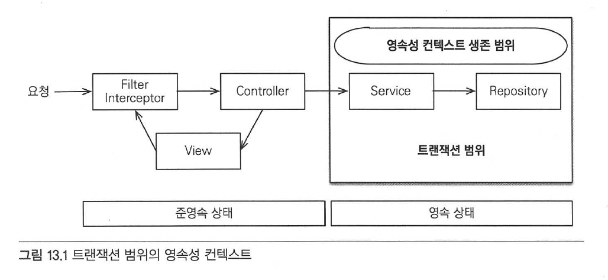
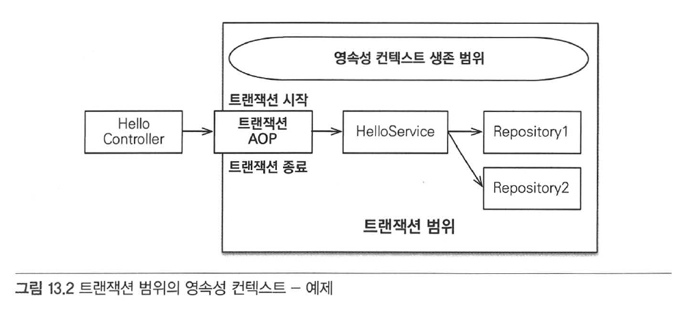
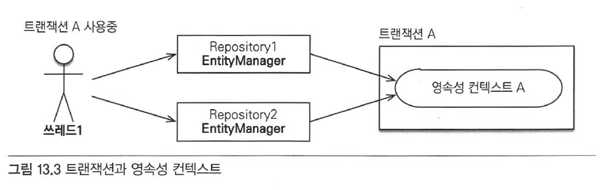
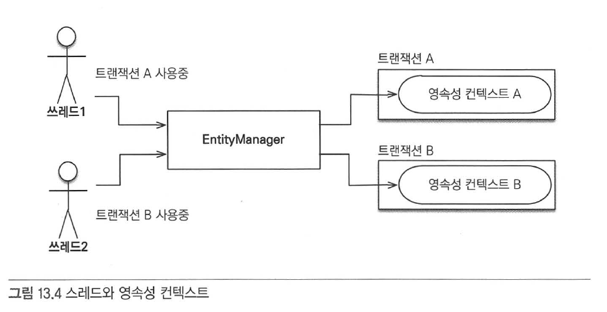

# Chapter 13 "웹 애플리케이션과 영속성 관리"

* 스프링이나 J2EE 컨테이너 환경에서 JPA를 사용하면 컨테이너가 트랜잭션과 영속성 컨텍스트를 관리해주므로 애플리케이션을 손쉽게 개발할 수 있다.
* 하지만, 컨테이너 환경에서 JPA 가 동작하는 내부 동작 방식을 이해하고 있어야, 문제가 발생했을때 해결할 수 있다.

## 1. 트랜잭션 범위의 영속성 컨텍스트

* 스프링이나 J2EE 컨테이너 환경에서 JPA를 사용하면 컨테이너가 제공하는 전략을 따라야 한다.

### 1.1. 스프링 컨테이너의 기본 전략

* `트랜잭션 범위의 영속성 컨텍스트 전략`
* 트랜잭션 범위와 영속성 컨텍스트의 생존 범위가 같다.



* 트랜잭션을 시작할 때 영속성 컨텍스트를 생성하고 트랜잭션이 끝날 때 영속성 컨텍스트를 종료한다. 그리고 같은 트랜잭션 안에서는 항상 같은 영속성 컨텍스트에 접근한다.



* `@Transactional` 어노테이션이 있으면 호출한 메소드를 실행하기 직전에 스프링의 트랜잭션 AOP가 먼저 동작한다. 스프링 트랜잭션 AOP는 대상 메소드를 호출하기 직전에 트랜잭션을 시작하고, 대상 메소드가 정상 종료되면 트랜잭션을 커밋하면서 종료한다.
* 트랜잭션을 커밋하면 JPA는 먼저 영속성 컨텍스트를 플러시해서 변경 내용을 데이터베이스에 반영한 후에 데이터베이스 트랜잭션을 커밋한다.

#### # 다른 위치에서 엔티티 매니저를 주입 받아 사용해도, 트랜잭션이 같으면 같은 영속성 컨텍스트를 사용한다.

* 같은 트랜잭션 범위에 있으면, 엔티티 매니저는 달라도 같은 영속성 컨텍스트를 사용한다.



#### # 트랜잭션이 다르면 다른 영속성 컨텍스트를 사용한다.

* 여러 스레드에서 동시에 요청이 와서 같은 엔티티 매니저를 사용해도 트랜잭션에 따라 접근하는 영속성 컨텍스트가 다르다.
* 스프링 컨테이너는 스레드마다 각각 다른 트랜잭션을 할당하기 때문에, 멀티 스테드 상황에 안전하다.



> 트랜잭션과 복잡한 멀티 스레드 상황을 컨테이너가 처리해주므로, 개발자는 결과적으로 비즈니스 로직 개발에 집중할 수 있다.

## 2. 준영속 상태와 지연 로딩

*  트랜잭션이 보통 서비스 계층에서 시작하므로 서비스 계층이 끝나는 시점에 트랜잭션이 종료되면서 영속성 컨텍스트도 함께 종료된다.
* 따라서 조회한 엔티티가 서비스와 리포지토리 계층에서는 영속성 컨텍스트에 의해 영속 상태를 유지하지만, 콘트롤러나 뷰 같은 프리젠테이션 계층에서는 준영속 상태가 된다.

```java
class OrderController {
	public String view(Long orderId) {
		Order order = orderService.findOne(orderId);
		Member member = order.getMember();
		member.getName(); // 지연 로딩 시 예외 발생
		...
	}
}
```

* 트랜잭션이 없는 프리젠테이션 계층에서 엔티티는 준영속 상태이므로 변경 감지와 지연 로딩이 동작하지 않는다.
* 위 컨트롤러 로직의 경우, 지연 로딩 시점에 예외가 발생한다.

#### # 준영속 상태와 변경 감지

* 만약 프리젠테이션 계층에서도 동작하면 애플리케이션 계층이 가지는 책임이 모호해진다.
* 데이터를 어디서 어떻게 변경했는지 프리젠테이션 계층까지 다 찾아야 하므로 애플리케이션을 유지보수하기 어렵다.

#### # 준영속 상태와 지연 로딩

* 뷰를 렌더링할 때 연관된 엔티티도 함께 사용해야 하는데, 연관된 엔티티를 지연 로딩으로 설정해서 프록시 객체로 조회하면, 준영속 상태는 영속성 컨텍스트가 없으므로 지연 로딩을 할 수 없다.

#### # 준영속 상태 지연 로딩 해결 전략

* 뷰가 필요한 엔티티를 미리 로딩해두는 방법 (어디서 로딩하느냐에 따라)
    * 글로벌 페치 전략 수정
    * JPQL 페치 조인(fetch join)
    * 강제로 초기화
* OSIV를 사용해서 엔티티를 항상 영속 상태로 유지하는 방법

### 2.1. 글로벌 페치 전략 수정

* 글로벌 페치 전략을 지연 로딩에서 즉시 로딩으로 변경하면 된다.

```java
@Entity
public class Order {
	@Id @GeneratedValue
	private Long id;

	@ManyToOne(fetch = FetchType.EAGER) // 즉시 로딩 전략
	private Member member; // 주문 회원
	...
}

// 프레젠테이션 로직
Order order = orderSerivce.findOne(orderId);
Member member = order..getMember();
member.getName();   // 이미 로딩된 데이터
```

#### # 글로벌 페치 전략에 즉시 로딩 사용 시 단점

<1> 사용하지 않는 엔티티를 로딩한다.
* 예를 들어, 화면 A에서는 order, member가 모두 필요하여 글로벌 전략을 즉시 로딩으로 설정했으나, 화면 B에서는 order 엔티티만 있으면 충분함에도 즉시 로딩 전략으로 인해 필요하지 않은 member도 함께 조회하게 된다.

<2> N+1 문제가 발생한다.

```java
List<Order> orders = 
		em.createQuery("select o from Order o", Order.class)
		.getResultList(); // 연관된 모든 엔티티를 조회한다. 

// 실행된 SQL문 결과
// select * from Order // JPQL로 실행된 SQL
// select * from Member where id=? // EAGER로 실행된 SQL
// select * from Member where id=? // EAGER로 실행된 SQL
// select * from Member where id=? // EAGER로 실행된 SQL
// select * from Member where id=? // EAGER로 실행된 SQL
// select * from Member where id=? // EAGER로 실행된 SQL
...
```

* JPA가 JPQL을 분석해서 SQL을 생성할 때는 글로벌 페치 전략을 참고하지 않고 오직 JPQL 자체만 사용한다. 따라서, 즉시 로디이든 지연 로딩이든 구분하지 않고 JPQL 쿼리 자체에 충실하게 SQL을 만든다.
* 코드 내부 동작 순서
    1. `select o from Order o` JPQL을 분석해서 `select * from Order SQL`을 생성한다.
    1. 데이터베이스에서 결과를 받아 order 엔티티 인스턴스들을 생성한다.
    1. Order.member의 글로벌 페치 전략이 즉시 로딩이므로 order를 로딩하는 즉시 연관된 member도 로딩해야 한다.
    1. 연관된 member를 영속성 컨텍스트에서 찾는다.
    1. 만약 영속성 컨텍스트에 없으면 `SELECT * FROM MEMBER WHERE id=?` SQL을 조회한 order 엔티티 수만큼 실행한다.
* 처음 조회한 데이터 수만큼 다시 SQL을 사용해서 조회하는 것을 N+1 문제라 한다.
