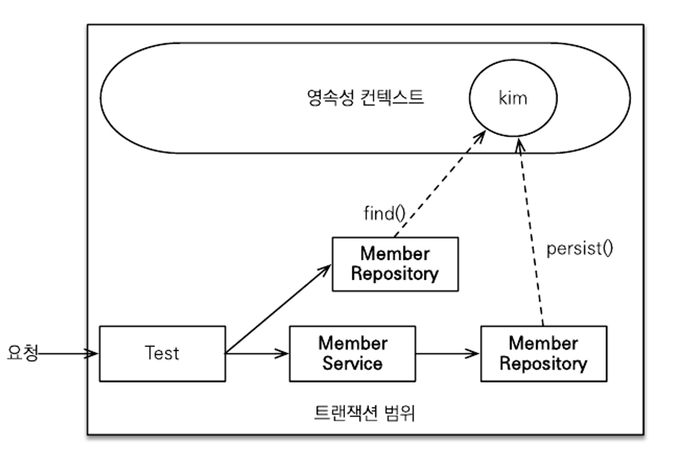
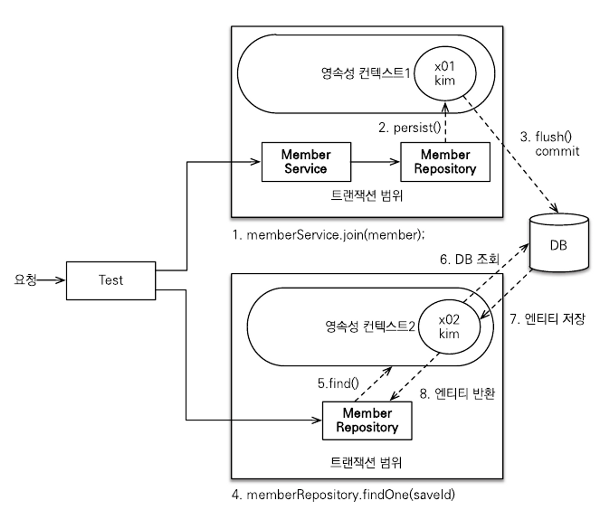
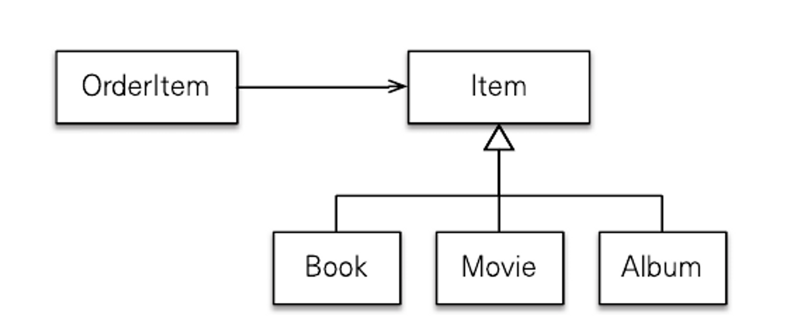
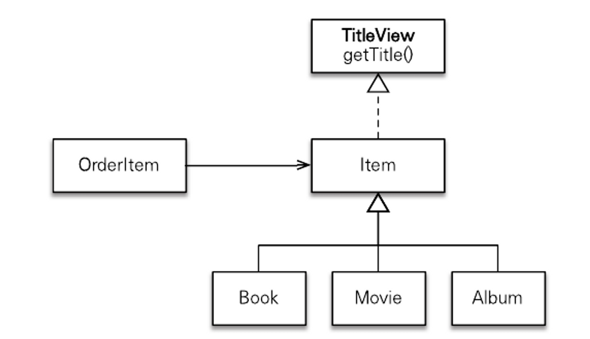

# Chapter15 고급 주제와 성능 최적화

## 배울 내용

1. 예외 처리
    1. JPA를 사용할 때 발생하는 다양한 예외와 예외에 따른 주의점
2. 엔티티 비교
    1. 엔티티를 비교할 때 주의점과 해결 방법
3. 프록시 심화 주제
    1. 프록시로 인해 발생하는 다양한 문제점과 해결 방법
4. 성능 최적화
    1. N+1 가 발생하는 상황과 해결 방법
    2. 엔티티를 읽기 전용으로 쿼리할 때 성능 최적화 방안
    3. 수백만건의 데이터를 처리해야 하는 배치 처리 상황에 JPA를 어떻게 사용할 수 있는지
    4. 하이버네이트를 통해 SQL 쿼리 힌트를 사용하는 방법
    5. 트랜잭션을 지원하는 쓰기 지연을 통해 성능일 최적화하는 방법


## 15.1 예외 처리

### 15.1.1 JPA 표준 예외 정리

- JPA 표준 예외는 `javax.persistence.PersistenceException` 의 자식 클래스이다.
- 이 예외 클래스는 RuntimeException의 자식 클래스이므로 **Unchecked Exception**이다.
- ***따라서 JPA의 모든 예외는 언체크 예외이다.***
- JPA 표준 예외는
    - 트랜잭션 롤백을 표시하는 예외
        - 심각한 예외
    - 트랜잭션 롤백을 표시하지 않는 예외로 나뉜다.
        - 그리 심각한 예외는 X
        - 개발자가 트랜잭션을 커밋할지 롤백할지 판단
- **트랜잭션 롤백을 표시하는 예**

| 예시 | 설명 |
| --- | --- |
| javax.persistence.EntityExistException | EntityManager.persist(...) 호출 시 이미 같은 엔티티가 있으면 발생한다. |
| java.persistence.EntityNotFoundException | EntityManager.getReference(...)를 호출했는데 실제 사용 시 엔티티가 존재하지 않으면 발생. refersh(...), lock(...)에서도 발생한다. |
| javax.persistence.OptimisticLockException | 낙관적 락 충돌 시 발생한다. |
| javax.persistence.PessimisticLockException | 비관적 락 충돌 시 발생한다. |
| javax.persistence.RollbackException    EntityTransaction.commit() | 실패 시 발생, 롤백이 표시되어 있는 트랜잭션 커밋 시에도 발생한다. |
| javax.persistence.TransactionRequiredException | 트랜잭션이 필요할 때 트랜잭션이 없으면 발생. 트랜잭션 없이 엔티티를 변경할 때 주로 발생한다. |
- **트랜잭션 롤백을 표시하지 않는 예**

| 예시 | 설명 |
| --- | --- |
| javax.persistence.NoResultException | Query.getSingleResult() 호출 시 결과가 하나도 없을 때 발생한다 |
| javax.persistence.NonUniqueResultException | Query.getSingleResult() 호출 시 결과가 둘 이상일 때 발생한다. |
| javax.persistence.LockTimeoutException | 비관적 락에서 시간 초과 시 발생한다 |
| javax.persistence.QueryTimeoutException | 쿼리 실행 시간 초과 시 발생한다. |

### 15.1.2 스프링 프레임워크의 JPA 예외 변환

- 서비스 계층에서 JPA의 예외를 직접 사용하면 JPA에 의존적이므로 스프링 프레임워크는 데이터 접근 계층에 대한 예외를 추상화하여 개발자에게 제공한다.
- **JPA 예외를 스프링 예외로 변경**

| JPA 예외 | 스프링 변환 예외 |
| --- | --- |
| javax.persistence.PersistenceException | org.springgramework.orm.jpa.JpaSystemException |
| javax.persistence.NoResultException | org.springfreamework.dao.ExptyResultDataAccessException |
| javax.persistence.NonUniqueResultException | org.springframework.dao.IncorrectrResultSizeDataAccessException |
| javax.persistence.LockTimeoutException | org.springframework.dao.CannotAcquireLockException |
| javax.persistence.QueryTimeoutException | org.springframework.dao.DataIntegrityViolationException |
| javax.persistence.EntityExistException | org.springframework.orm.jpa.JpaObjectRetrievalFailurewException |
| javax.persistence.EntityNotFoundException | org.springframework.orm.jpa.JpaObjectRetrivalFailtueException |
| javax.persistence.OptimisticLockException | org.springframework.dao.JpaOptimisticLockingFailureException |
| javax.persistence.PessimisticLockException | org.springframework.dao.PessimisticLockingFailureException |
| javax.persistence.TransactionRequiredException | org.springframework.dao.InvalidDataAccessApiUsageException |
| javax.persistence.RollbackException | org.springframework.transaction.TransactionSystemException |
- **JPA 예외를 스프링 예외로 변경 추가 (JPA 표준 명세상 발생할 수 있는 두 예외)**

| JPA 예외 | 스프링 변환 예외 |
| --- | --- |
| java.lang.IllegalStateException | org.springframework.dao.InvalidDataAccessApiUsageException |
| java.lang.IllegalArgumentException | org.springframework.dao.InvalidDataAccessApiUsageException |

### 15.1.3 스프링 프레임워크에 JPA 예외 변환기 적용

- JPA 예외를 스프링 프레임워크가 제공하는 추상화된 예외로 변경하려면 `PersistenceExceptionTranslationPostProcessor` 를 스프링 빈으로 등록하면 된다.
- 이것은 @Repository 어노테이션을 사용한 곳에 예외 변환 AOP를 적용해서 JPA 예외를 스프링 프레임워크가 추상화한 예외로 변환해 준다.
- 사용법

```xml
<bean class="org.springframework.dao.annotation.PersistenceExceptionTranslationPostProcessor" />
```

```java
@Bean
public PersistenceExceptionTranslationPostProcessor exceptionTranslation() {

return new PersistenceExceptionTranslationPostProcessor();

}
```

- 예외를 변환하지 않고 그대로 반환하고 싶으면 다음처럼 `throws`절에 그대로 반환할 `JPA`예외나 `JPA`예외의 부모 클래스를 직접 명시 하면 된다.

```java
@Repository
public class NoResultExceptionTestService {
	@PersistenceContext EntityManager em;

	public Member findMember() throws javax.persistence.NoResultException {
		return em.creteQuery("select m from Member m", Member.class).getSingleResult();
	}
}
```

### 15.1.4 트랜잭션 롤백 시 주의사항

- 트랜잭션을 롤백하는 것은 데이터베이스의 반영 사항만 롤백 하는 것이지, 수정한 자바객체까지 원 상태로 복구해주지는 않는다.
- 따라서 새로운 영속성 컨텍스트를 생성해서 사용하거나 `EntityManager.clear()`를 호출해서 영속성 컨텍스트를 초기화한 다음에 사용해야 한다.
- 스프링 프레임워크는 위 문제를 예방하기 위하여 영속성 컨텍스트의 범위에 따라 다른 방법을 적용한다.
    - 기본 전략 : 트랜잭션 당 영속성 컨텍스트
        - 트랜잭션 AOP 종료 시점에 트랜잭션을 롤백하면서 영속성 컨텍스트 종료
    - OSIV : 영속성 컨텍스트의 범위를 트랜잭션 범위보다 넓게 사용
        - 여러 트랜잭션이 하나의 영속성 컨텍스트를 사용하는 상황임.
        - 이때는 트랜잭션 AOP 롤백 시, 영속성 컨텍스트를 초기화한다.

## 15.2 엔티티 비교

- 영속성 컨텍스트 내부에는 엔티티 인스턴스를 보관하는 1차 캐시가 있으며, 애플리케이션 수준의 반복 가능한 읽기 기능을 제공한다.
- 같은 영속성 컨텍스트에서 엔티티를 조회하면 주소 값이 같은, 항상 동일한 인스턴스를 반환한다. (`==` 비교)

### 15.2.1 영속성 컨텍스트가 같을 때 엔티티 비교

- 영속성 컨텍스트를 통해 데이터를 저장하거나 조회하면 1차 캐시에 엔티티가 저장된다.
- 이 1차 캐시 덕분에 `변경 감지`기능도 동작하고, 이름 그대로 `1차 캐시`로 사용 되어서 데이터베이스를 통하지 않고 데이터를 바로 `조회`할 수도 있다.

```java
@RunWith(SpringJUnit4ClassRunner.class)
@ContextConfiguration(locations = "classpath:appConfig.xml")
@Transactional
public class MemberServiceTest {

	@Test
	public void register() throws Exception {
		// Given
		Member member = new Member("kim");

		// When
		Long saveId = memberService.join(member);

		// Then
		Member findMember = memberRepository.findOne(saveId);
		assertTrue(member == findMember); // true 참조값 비교
	}
}

@Teansactional
public class MemberService {
    ...
}

@Repository
public class MemberRepository {
    ...
}
```
- 결과는 true 이다.
- 이것은 같은 트랜잭션 범위에 있으므로 같은 영속성 컨텍스트를 사용하기 때문이다. 따라서 영속성 컨텍스트가 같으면 엔티티를 비교할 때 다음 3가지 조건을 모두 만족한다.
    - 동일성: `==` 비교가 같다
    - 동등성 : `equals()` 비교가 같다
    - 데이터베이스 동등성 : `@Id`인 데이터베이스 식별자가 같다
- 트랜잭션 범위를 그림으로 나타내면 아래와 같다.
    - 테스트 메소드인 `register()` 는 이미 트랜잭션 범위에 들어있고, 이 메소드가 끝나면 트랜잭션이 종료된다. 그러므로 `register()` 에서 사용된 코드는 항상 같은 트랜잭션과, 같은 영속성 컨텍스트에 접근한다. 이러한 이유로 `member` 와 `findMember` 는 애플리케이션 수준의 반복 가능한 읽기 기능에 따라 동일한 객체임을 보장한다.
    - 참고로 테스트와 서비스에 모두 @Transactional이 있는데, 기본 전략은 먼저 시작된 트랜잭션이 있으면 그 트랜잭션을 그대로 이어 받아 사용하고 없으면 새로 시작한다.



### 15.2.2 영속성 컨텍스트가 다를 때 엔티티 비교

- 이번에는 테스트 클래스의 @Transactional를 제거해 보자.

```java
@SpringBootTest
class MemberServiceTest {

    @Autowired
    private MemberService memberService;

    @Autowired
    private MemberRepository memberRepository;

    @Test
    public void register() {
        Member member = new Member("jayon");

        Long saveId = memberService.join(member);

        Member findMember = memberRepository.findById(saveId).get();
        assertThat(findMember == member).isTrue();
    }
}

@Teansactional
public class MemberService {
    ...
}

@Repository
public class MemberRepository {
    ...
}
```

- 이 때 `register()` 테스트는 실패한다. 그 (사진은 `findOne()`으로 되어 있는데, `findById()`
 로 생각해도 된다.
    - 테스트 코드에서 `memberService.join(member)` 를 호출해서 회원 가입을 시도하면 서비스 계층에서 트랜잭션이 시작되고 영속성 컨텍스트 1이 만들어진다.
    - memberRepository에서 `em.persist()` 를 호출해서 member 엔티티를 영속화한다.
    - 서비스 계층이 끝날 때 트랜잭션이 커밋되면서 영속성 컨텍스트가 플러시된다. 이때 트랜잭션과 영속성 컨텍스트가 종료된다. 따라서 member 엔티티 인스턴스는 준영속 상태가 된다.
    - 테스트 코드에서 `memberRepository.findById(saveId)` 를 호출해서 저장한 엔티티를 조회하면 Repository 계층에서 새로운 트랜잭션이 시작되면서 새로운 영속성 컨텍스트 2가 생성된다.
    - 저장된 회원을 조회하지만, 새로 생성된 영속성 컨텍스트 2에는 찾는 회원이 없다.
    - 따라서 데이터베이스에서 회원을 찾아 온다.
    - 데이터베이스에서 조회된 회원 엔티티를 영속성 컨텍스트에 보관하고 반환한다.
    - `memberRepository.findById()` 메소드가 끝나면서 트랜잭션이 종료되고 영속성 컨텍스트2도 종료된다.



- 따라서 위 상황에서 member와 findMember를 비교하려면 동일성(==)이 아닌 동등성(equals) 비교를 해야 한다.
- 이때 서로의 PK 값이 같으면 같은 객체로 판단하게끔 `equals()` 메소드를 재정의하는 것이 좋다.

## 15.3 프록시 심화 주제

- 프록시는 원본 엔티티를 상속받아서 만들어지므로 엔티티를 사용하는 클라이언트는 엔티티가 프록시인지 아니면 원본 엔티티인지 구분하지 않고 사용할 수 있다.
- 이로 인해 예상하지 못한 문제들이 발생하기도 하는데, 어떤 문제가 발생하고 어떻게 해결해야 하는지 알아보자

### 15.3.1 영속성 컨텍스트와 프록시

- 영속성 컨텍스트는 자신이 관리하는 영속 엔티티의 동일성을 보장한다.
- **프록시는 원본 엔티티를 상속받아서 만들어지므로** 엔티티를 사용하는 클라이언트는 엔티티가 프록시인지 원본 엔티티인지 구분하지 않고 사용할 수 있다.

```java
Member refMember = em.getReference(Member.class, "member1"); // 프록시
Member findMember = em.find(Member.class, "member1"); // 원본 엔티티
```

- 위 코드는 다른 서로 다른 인스턴스로 생각할 수 있지만, 이렇게 되면 영속성 컨텍스트가 영속 엔티티의 동일성을 보장하지 못하는 문제가 발생한다.
- 영속성 컨텍스트는 프록시로 조회된 엔티티에 대해서 같은 엔티티를 찾는 요청이 오면, 원본 엔티티가 아닌 처음 조회된 프록시를 반환한다.
- 따라서, `em.find()` 의 결과는 `member1` 의 프록시 반환 (member1 엔티티를 프록시로 처음 조회했기 때문에)

```java
Member findMember = em.find(Member.class, "member1");
Member refMember = em.getReference(Member.class, "member1");
```

=> `em.getReference()` 의 결과는 `member`의 엔티티 (원본 엔티티를 미리 조회했기 때문에 굳이 프록시를 반환할 필요 X)

> 즉, 영속성 컨텍스트에 원본 엔티티이든, 프록시이든 먼저 조회해 놓은 것을 이후에도 반환한다.
**영속성 컨텍스트는 자신이 관리하는 영속 엔티티의 동일성을 보장한다.**
>

### 15.3.2 프록시 타입 비교

- 프록시는 원본 엔티티를 상속받아서 만들어지므로 프록시로 조회한 엔티티의 타입을 비교할 때는 `== (동일성)` 
 비교 대신 `instanceof` 를 사용해야 한다.

```java
Member refMember = em.getReference(Member.class, "member1");
Assert.assertFalse(Member.class == refMember.getClass()); // false
Assert.assertTrue(refMember instanceof Member); // true
```

- `refMember.getClass()` 결과는 `class jpabook.advanced.Member_$$_jvsteXXX`이다. `_$$_jvsteXXX` 가 붙어 있으면 프록시라는 의미이다.
- `Member.class == refMember.getClass()`는 부모 클래스와 자식 클래스를 == 비교한 셈이다.
- 프록시는 원본 엔티티의 자식 타입이므로 `instanceof` 연산을 사용해야 한다.

### 15.3.3 프록시 동등성 비교

- 엔티티의 동등성 비교 시 비즈니스 키를 사용해 `equals()` 메소드를 오버라이딩하고 비교한다.
- **이때, 비교 대상이 원본 엔티티면 문제가 없지만, 프록시면 문제가 발생할 수 있다.**
- ****프록시의 동등성 비교 시 주의 사항****
    1.  프록시의 타입 비교는 == 비교 대신에 `instanceof` 를 사용해야 한다.
    2. 프록시의 멤버 변수에 직접 접근하면 null 이 반환된다. 따라서 대신에 접근자 메소드(getter)를 사용해야 한다.
        1. 프록시는 실제 데이터를 갖고 있지 않다. 따라서 프록시의 멤버 변수에 직접 접근하면 아무 값도 조회되지 않는다.
- 프록시 동등성 비교 예제코드

```java
@Entity
public class Member {
  private String name;
  ...
  // Getter, Setter
  ...
  @Override
  public boolean equals(Object obj){
      if(this == obj) return true;
      if(!(obj instanceof Member)) return false;
      Member member = (Member) obj;
      if(name != null ? !name.equals(member.getName()) : member.getName() != null)
          return false;
      return true;
  }
  @Override
  public int hashCode() {
      return name != null ? name.hashCode() : 0;
  }
}

 @Test
 public void 프록시와_동등성비교() {
     Member saveMember = new Member("member1", "회원1");
     em.persist(saveMember);
     em.flush();
     em.clear();

     Member newMember = new Member("member1", "회원1");
     Member refMember = em.getReference(Member.class, "member1");

     Assert.assertTrue(newMember.equals(refMember)); // ?
 }
```

### 15.3.4 상속관계와 프록시



- 프록시를 부모 타입으로 조회하면 문제가 발생한다.
- 어떤 문제가 발생할까?

```java
@Entity
public class OrderItem {

    @Id
    @GeneratedValue
    private Long id;

    @ManyToOne(fetch = FetchType.LAZY)
    @JoinColumn(name = "ITEM_ID")
    private Item item; // 지연로딩으로 설정해서 item이 프록시로 조회됨

    ...
}
```

```java
@Test
public void 부모타입으로_프록시조회() {
    Book saveBook = new Book();
    saveBook.setName("jpabook");
    saveBook.setAuthor("kim");
    em.persist(saveBook);

    em.flush();
    em.clear();

    Item proxyItem = em.getReference(Item.class, saveBook.getId());
    System.out.println("proxyItem = " + proxyItem.getClass()); // proxyItem = class jpabook.proxy.advanced.item.Item_$$_jvstXXX

    if (proxyItem instanceof Book) { // if문 조건이 false.
        Book book = (Book) proxyItem;
        System.out.println("책 저자 = " + book.getAuthor()); // 출력 안됨.
    }

    assertThat(proxyItem.getClass() == Book.class).isTrue(); // 실패
    assertThat(proxyItem instanceof Book).isTrue(); // 실패
    assertThat(proxyItem instanceof Item).isTrue(); // 성공
```

- `em.getReference()` 메소드에서 Item 엔티티를 대상으로 조회했으므로 프록시인 proxyItem은 Item 타입을 기반으로 만들어진다.
- 따라서 proxyItem은 Item$Proxy 타입이므로, Book 타입과는 관계가 없다.
- 정리하자면, 프록시를 부모 타입으로 조회하면
    - instanceof 연산을 사용하여 하위 타입으로 비교할 수 없다.
    - 하위 타입으로 다운 캐스팅을 할 수 없다.
- 프록시를 부모 타입으로 조회하는 문제는 주로 아래 코드와 같이 다형성을 다루는 도메인 모델에서 나타난다.

```java
@Entity
public class OrderItem {

    @Id
    @GeneratedValue
    private Long id;

    @ManyToOne(fetch = FetchType.LAZY)
    @JoinColumn(name = "ITEM_ID")
    private Item item; // 지연로딩으로 설정해서 item이 프록시로 조회됨

    ...
}
```

- 해결방법
1. **JPQL로 대상 직접 조회 (가장 간단)**
    - 처음부터 자식 타입을 직접 조회. 하지만 다형성을 활용할 수 없음

```java
Book book = em.createQuery
    ("select b from Book b where b.id=:bookId", Book.class)
        .setParameter("bookId", item.getId())
        .getSingleResult();
```

2. **프록시 벗기기**
   - 하이버네이트가 제공하는 `unProxy()`메소드를 통해 프록시에서 원본 엔티티를 가져올 수 있다.

```java
  ...
	Item item = orderItem.getItem();
	Item unProxyItem = unProxy(item);
	
	if (unProxyItem instanceof Book) {
		System.out.println("proxyItem instanceod Book");
		Book book = (Book) unproxyItem;
		System.out.println("책 저자 = " + book.getAuthor());
	}
	
	Assert.assertTrue(item != unProxyItem);
}

//하이버네이트가 제공하는 프록시에서 원본 엔티티를 찾는 기능을 사용하는 메소드
public static <T> T unProxy(Object entity){
	if(entity instanceof HibernateProxy) {
		entity = ((HibernateProxy) entity)
							.getHibernateLazyInitializer()
							.getImplementation();
	}
	return (T) entity;
}
```

하지만  이 방법은 프록시에서 원본 엔티티를 직접 꺼내기 때문에 프록시와 원본 엔티티의 `동일성(==) 비교`가 실패한다는 문제점이 있다.

```java
item == unProxyItem // false
```

따라서 이 방법을 사용할 때는 원본 엔티티가 꼭 필요한 곳에서 잠깐 사용하고 다른 곳에서 사용되지 않도록 하는것이 중요하다.

3. **기능을 위한 별도의 인터페이스 제공**
   - 프록시 인터페이스 정의
       - TitleView라는 공통 인터페이스를 만들고 자식 클래스들은 인터페이스의 getTitle() 메소드를 각각 구현

     


```java
public interface TitleView {
    String getTitle();
}

@Entity
@Inheritance(strategy = InheritanceType.SINGLE_TABLE)
@DiscriminatorColumn(name = "DTYPE")
public abstract class Item implements TitleView {
    @Id @GeneratedValue
    @Column(name = "ITEM_ID")
    private Long id;
    private String name;
    private int price;
    private int stockQuantity;
    // Getter, Setter
}

@Entity
@DiscriminatorValue("B")
public class Book extends Item {
    private String author;
    private String isbn;
    @Override
    public String getTitle(){
        return "[제목:" + getName() + " 저자:" + author + "]";
    }
}

@Entity
@DiscriminatorValue("M")
public class Movie extends Item {
    private String director;
    private String actor;
    @Override
    public String getTitle(){
      return "[제목:" + getName() + " 감독:" + director + " 배우:" + actor + "]";
    }
}
```

- 이처럼 인터페이스를 제공하고 각각의 클래스가 자신에 맞는 기능을 구현하여 다형성을 활용하는 것이 좋다.
- 이 방법은 클라이언트 입장에서 대상 객체가 프록시인지 아닌지 고민 할 필요가 없다.
- 즉, 프록시를 다운캐스팅하거나 벗기는 일 없이 그대로 `getTitle()` 메소드를 호출하면 된다.