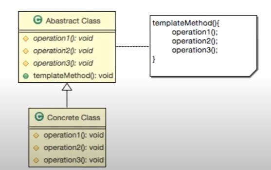

## 3_템플릿패턴(Template Patterm)

- 알고리즘의 구조를 메소드의 정의하고, 하위 클래스에서 알고리즘 구조의 변경없이 알고리즘을 재정의 하는 패턴
- 어떠할 때 사용할까?
    - 구현하려는 알고리즘이 일정한 프로세스가 있는 경우
    - 구현하려는 알고리즘이 변경 가능성이 있는 경우
    - 전체적으로는 동일하면서 부분적으로는 다른 구문으로 구성된 메서드의 코드 중복을 최소화 할 때 유용하다.

- 어떠한 단계로 이루어질까?
    1. 알고리즘을 여러 단계로 나눈다.
    2. 나눠진 알고리즘의 단계를 메소드로 선언한다.
    3. 알고리즘을 수행할 템플릿 메소드를 만든다.
    4. 하위 클래스에서 나눠진 메소드를 구현한다.

