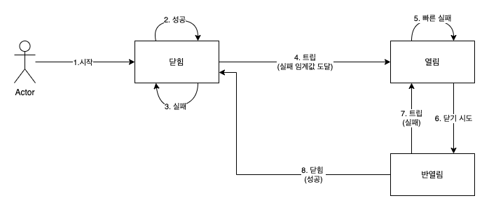
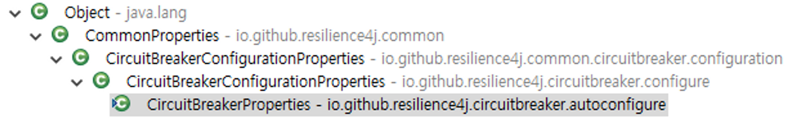

# Resilience4j

## 시작에 앞서

- Circuit Breaker가 필요한 이유는 누전차단기가 전기사고가 발생하기 전에 전기를 미리 차단하는것과 동일하게 **문제가 있는 마이크로서비스로의 트래픽을 차단**하여 **전체서비스가 느려지거나 중단되는것을 미리 방지**하기 위해서 이다.

## ****Resilience4j란?****

- 서킷 브레이커는 다량의 오류를 감지하면 서킷을 열어 새 호출을 받지 않는다.
- 서킷 브레이커는 서킷이 열려 있을 때 빠른 실패 로직을 수행한다. 즉 이어지는 호출에서 시간 초과, 예외 발생 등 오류가 발생하지 않게, 폴백 메서드 호출을 리다디렉션을 한다. 폴백 메서드에서 다양한 비즈니스 로직을 적용하면 로컬 캐시의 데이터를 반환하거나 즉각적인 오류 메시지를 반환하는 등 최적화된 응답을 생성할 수 있다. 이로써 의존하는 서비스의 응답 중단 때문에 마이크로 서비스가 응답하지 못하게 되는 문제를 방지할 수 있는다.
- 시간이 지나면 서킷 브레이커는 반열림 상태로 전환돼 새로운 호출을 허용하며, 이를 통해 문제를 일으킨 원인이 사라졌는지 확인한다. 서킷 브레이커는 새로운 오류를 감지하면서 서킷을 다시 열고 빠른 실패 로직을 다시 수행하며, 오류가 사라졌으면 서킷을 닫고 정상 작동 상태로 돌아간다.

Resilience4j는 런타임에 다양한 방법으로 서킷 브레이커의 정보를 공개한다.

- 서킷 브레이커의 현재 상태를 마이크로 서비스 액추에이터 상태 점검 엔드 포인트(/actuator/health)를 사용해 모니터링할 수 있다.
- 서킷 브레이커는 상태 전이 등의 이벤트 액추에이터 엔드 포인트(/actuator/citcuitbreakerevents)를 게시한다.
- 서킷 브레이커 스프링 부트의 매트릭스 시스템과 통합돼 있으며 이를 이용해 프로테우스와 같은 모니터링 도구에 메트릭을 게시할 수 있다.

# **CircuitBreaker Config 설정**

| Properties | Description |
| --- | --- |
| ringBufferSizeInClosedState | 닫힌 상태에서의 호출 수로, 서킷을 열어 할지 결정할 때 사용한다. |
| failureRateThreshold | 실패한 호출에 대한 임계값(백분율)으로 이 값을 초과하면 서킷이 열린다. |
| waitInterval | 반열림 상태로 전환하기 전에 시킷을 열린 상태로 유지하는 시간 |
| ringBufferSizeInHalfOpenState | 반열림 상태에서의 호출 수로, 서킷을 다시 열거나 닫힘 상태로 돌아갈지를 결정할 때 사용 한다. |
| automaticTransitionFromOpenToHalfOpenEnabled | 대기 시간이 지난 후에 서킷을 반열림 상태로 자동 전환할지, 첫 번째 호출이 들어오길 기다렸다가 반열림 상태로 전환할지를 결정한다. |
| ignoreExceptions | 오류를 간주하지 않을 예외를 지정한다. 보통 InvaildInputException, NotfoundExceotion과 같이 예상할 수 있는 비즈니스 예외는 서킷 브레이커에서 무시하는데, 존재하지 않은 데이터 검색이나 유요하지 않은 입력으로 발생하는 예외 때문에 서킷을 열어선 안되기 때문이다. |

다음과 같이 사용할 수 있다.

- ringBufferSizeInClosedState = 5, failureRateThreshold = 50% : 마지막 5개의 호출 중 3개 이상이 실패하면 서킷이 열린다.
- waitInterval = 10000, automaticTransitionFromOpenToHalfOpenEnabled = true : 서킷 브레이커는 10초 동안 서킷을 열린 상태로 유지했다가 반열림 상태로 전환한다.
- ringBufferSizeInHalfOpenState = 3 : 서킷 브레이커는 서킷 반열림 상태로 전환 후에 처음으로 유입된 3개의 호출을 기준 삼아 서킷의 열림 여부를 결정한다. failureRateThreshold = 50%으로 설정돼 있기 때문에 2개 이상 호출이 실패하면 서킷이 다시 열리며, 이 외 경우에는 서킷이 닫힌다.
- ignoreExceptions = InValidInputException, NotFoundException : 이 두 가지 비즈니스 예외는 서킷 브레이커에서 오류 여기지 않는다.

# **재시도 메커니즘**

재시도 메커니즘은 일시적인 네티워크 결함과 같음 무작위로 드물게 발생하는 오류에 매우 유용하다. 재시도 메커니즘은 설정된 대기 시간을 사이에 두고, 실패한 요청에 여러번 다시 시도하는 것이다. 재시도 메커니즘을 사용하기 위한 주요 요건 중 하나는 재시도 대상 서비스의 **멱등성**이 있어야 한다는 것이다. 만약 재시도 메커니즘에 의해 2개의 주문이 생성되는 일이 발생하지 않아야 하기 때문이다.

Resilience4j는 서킷 브레이커와 같은 방식으로 재시도 관련된 이벤트 및 메트릭 정보를 공개하지만 상태 정보는 전혀 공개하지 않으며, 재시도 이벤트에 관한 정보는 Actuator 엔드 포인트에서 얻을 수 있다. Resilience4j는 다음과 같은 매개변수를 사용한다.

| Properties | Description |
| --- | --- |
| maxRetryAttempts | 첫번째 호출을 포함한 총 재시도 횟수 |
| waitDuration | 재시도를 다시 수행하기 전의 대기 시간 |
| retryExceptions | 재시도를 트러거하는 예외 목록 |

다음과 같이 사용 가능하다.

- maxRetryAttempts = 3: 최대 두 번의 재시도를 수행한다.
- waitDuration = 1000: 재시도 사이의 대기 시간은 1초다.
- retryExceptions = IntervalServerError:HTTP 요청에 대한 응답으로 500 상태 코드가 오고, 발생한 예외가 IntervalServerError인 경우에만 재시도를 트리거 한다.

# Core modules

resilience4j는 다음과 같은 기능을 제공하고 각 기능에 대한 모듈 라이브러리를 제공한다.

| 기능 | 설명 | 모듈 |
| --- | --- | --- |
| CircuitBreaker | backend system의 상태 관리.CLOSED, OPEN, HALF_OPEN, DISABLED, FORCED_OPEN 상태가 있음 | resilience4j-circuitbreaker |
| Bulkhead | 병렬 작업 제한 관리 | resilience4j-bulkhead |
| RateLimiter | 요청 제한 관리 | resilience4j-ratelimiter |
| Retry | 재시도 관리 | resilience4j-retry |
| TimeLimiter | 실행 시간 제한 관리 | resilience4j-timelimiter |
| Cache | 캐시 처리 | resilience4j-cache |

core module들은 모두 resilience4j-core modue을 참조한다.

# Framework modules

Resilience4j를 사용하기 위한 스프링 관련 라이브러리를 스프링이 제공하지 않고 Resilience4j가 제공해준다.

이는 다른 framework에 대해서도 마찬가지이다.

- resilience4j-spring-boot: Spring Boot Starter
- resilience4j-spring-boot2: Spring Boot 2 Starter
- resilience4j-ratpack: Ratpack Starter
- resilience4j-vertx: Vertx Future decorator

이 모듈들은 모두 resilience4j-framework-common을 참조한다.

### Spring 관련 라이브러리 구성

resilience4j-spring-boot2는 resilience4j-spring을 참조하고 resilience4j-spring은 resilience4j-framework-common을 참조한다.

설정 정보에 대한 구성도 동일하게 상위 모듈의 class를 확장해서 쓰는 형태이다.

예를 들어 CircuitBreakerProperties는 다음과 같이 구성되어 있다.

Bulkhead, RateLimiter, Retry, TimeLimiter도 동일한 구성이며 다음과 같다.

| resilience4j-spring-boot2 | resilience4j-spring | resilience4j-framework-common | resilience4j-framework-common |
| --- | --- | --- | --- |
| BulkheadProperties | BulkheadConfigurationProperties | BulkheadConfigurationProperties.class | CommonProperties |
| CircuitBreakerProperties | CircuitBreakerConfigurationProperties | CircuitBreakerConfigurationProperties | CommonProperties |
| RateLimiterProperties | RateLimiterConfigurationProperties | RateLimiterConfigurationProperties | CommonProperties |
| RetryProperties | RetryConfigurationProperties | RetryConfigurationProperties | CommonProperties |
| TimeLimiterProperties | TimeLimiterConfigurationProperties | TimeLimiterConfigurationProperties | CommonProperties |

기본적인 설정은 모두 resilience4j-framework-common의 *Propeties에 있고 이를 확장한 resilience4j-spring은 order 정보만 추가로 가지고 있으며 이를 확장한 resilience4j-spring-boot2의 *Properties는 아무 설정값이 없다.

역할로 나누어 jar가 구성되어 있는데 resilience4j-spring-boot2는 boot autoconfiguration으로 동작할 설정을 담당하고 resilience4j-spring은 이렇게 boot로 설정된 값을 *Registry에 등록 및 spring bean 생성을 담당한다.